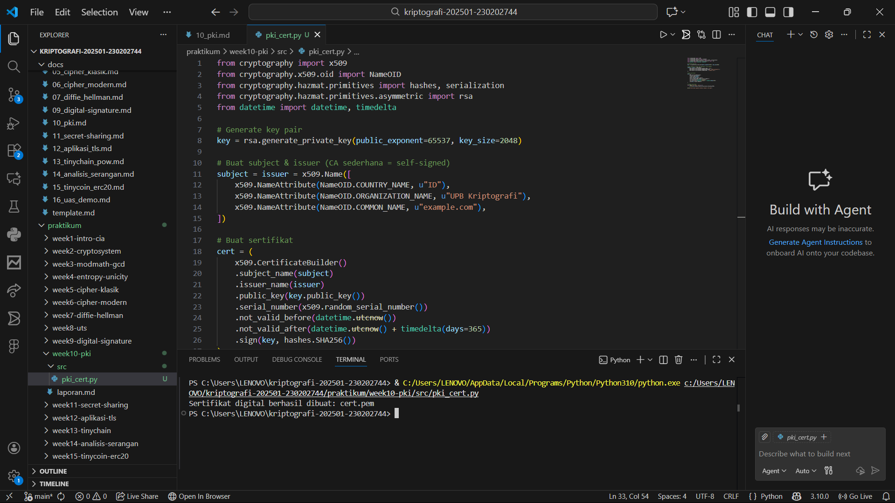

# Laporan Praktikum Kriptografi
Minggu ke-: 10  
Topik: Public Key Infrastructure (PKI & Certificate Authority)
Nama: Dimas Aditya Nugroho  
NIM: 230202744
Kelas: 5 IKRB  

---

## 1. Tujuan
Setelah mengikuti praktikum ini, mahasiswa diharapkan mampu:  
1. Membuat sertifikat digital sederhana.  
2. Menjelaskan peran Certificate Authority (CA) dalam sistem PKI.  
3. Mengevaluasi fungsi PKI dalam komunikasi aman (contoh: HTTPS, TLS). 
---

## 2. Dasar Teori
Public Key Infrastructure (PKI) adalah sistem yang mengelola penggunaan kriptografi kunci publik untuk menjamin keamanan komunikasi digital. PKI mencakup kebijakan, perangkat keras, perangkat lunak, dan prosedur yang digunakan untuk membuat, mendistribusikan, memverifikasi, serta mencabut sertifikat digital.

Certificate Authority (CA) adalah pihak tepercaya dalam PKI yang bertugas menerbitkan dan menandatangani sertifikat digital. CA memastikan keterkaitan antara identitas pemilik dengan kunci publik yang tercantum dalam sertifikat, sehingga memungkinkan proses otentikasi, integritas data, dan non-repudiation dalam sistem keamanan digital.
---

## 3. Alat dan Bahan
(- Python 3.x  
- Visual Studio Code / editor lain  
- Git dan akun GitHub  
- Library tambahan (misalnya pycryptodome, jika diperlukan)  )

---

## 4. Langkah Percobaan
(Tuliskan langkah yang dilakukan sesuai instruksi.  
Contoh format:
1. Membuat file `pki_cert.py` di folder `praktikum/week10-PKI/src/`.
2. Menyalin kode program dari panduan praktikum.
3. Menjalankan program dengan perintah `pki_cert.py`.
4. Membuat `verifikasi.py` untuk verifikasi tanda tangan)

---

## 5. Source Code
`pki_cert.py`
from cryptography import x509
from cryptography.x509.oid import NameOID
from cryptography.hazmat.primitives import hashes, serialization
from cryptography.hazmat.primitives.asymmetric import rsa
from datetime import datetime, timedelta

# Generate key pair
key = rsa.generate_private_key(public_exponent=65537, key_size=2048)

# Buat subject & issuer (CA sederhana = self-signed)
subject = issuer = x509.Name([
    x509.NameAttribute(NameOID.COUNTRY_NAME, u"ID"),
    x509.NameAttribute(NameOID.ORGANIZATION_NAME, u"UPB Kriptografi"),
    x509.NameAttribute(NameOID.COMMON_NAME, u"example.com"),
])

# Buat sertifikat
cert = (
    x509.CertificateBuilder()
    .subject_name(subject)
    .issuer_name(issuer)
    .public_key(key.public_key())
    .serial_number(x509.random_serial_number())
    .not_valid_before(datetime.utcnow())
    .not_valid_after(datetime.utcnow() + timedelta(days=365))
    .sign(key, hashes.SHA256())
)

# Simpan sertifikat
with open("cert.pem", "wb") as f:
    f.write(cert.public_bytes(serialization.Encoding.PEM))

print("Sertifikat digital berhasil dibuat: cert.pem")

`verifikasi.py`
from cryptography import x509
from cryptography.hazmat.primitives import hashes
from cryptography.hazmat.primitives.asymmetric import padding

# Baca sertifikat
with open("cert.pem", "rb") as f:
    cert = x509.load_pem_x509_certificate(f.read())

# Ambil public key (CA / issuer)
public_key = cert.public_key()

# Verifikasi tanda tangan sertifikat
try:
    public_key.verify(
        cert.signature,
        cert.tbs_certificate_bytes,
        padding.PKCS1v15(),
        cert.signature_hash_algorithm,
    )
    print("Verifikasi berhasil: Sertifikat valid dan asli.")
except Exception as e:
    print("Verifikasi gagal: Sertifikat tidak valid.")

---

## 6. Hasil dan Pembahasan

Pada percobaan ini dilakukan pembuatan sertifikat digital sederhana menggunakan konsep Public Key Infrastructure (PKI) dengan algoritma RSA. Program pki_cert.py berhasil menghasilkan pasangan kunci publik–privat dan membuat sertifikat self-signed, di mana subject dan issuer berasal dari entitas yang sama. Sertifikat ditandatangani menggunakan private key dengan algoritma hash SHA-256 dan disimpan dalam format PEM.

Selanjutnya, program verifikasi.py digunakan untuk memverifikasi keaslian sertifikat dengan memeriksa tanda tangan digital pada sertifikat menggunakan public key issuer. Hasil verifikasi menunjukkan bahwa sertifikat valid dan asli, menandakan bahwa sertifikat tidak mengalami perubahan dan ditandatangani oleh pihak yang sesuai.

Percobaan ini membuktikan bahwa mekanisme PKI dan peran Certificate Authority dapat dijalankan secara sederhana untuk menjamin keaslian sertifikat, integritas data, dan kepercayaan terhadap kunci publik.

1. cara CA digunakan untuk menjamin keaslian sertifikat.
Kode iverifikasi.py memverifikasi tanda tangan digital pada sertifikat menggunakan public key CA. Karena sertifikat bersifat self-signed, public key yang digunakan berasal dari sertifikat itu sendiri. Jika verifikasi berhasil, berarti sertifikat tidak dimodifikasi dan ditandatangani oleh pihak yang sah.

2. Diskusi Kasus
a. Bagaimana browser memverifikasi sertifikat HTTPS? 
Browser memverifikasi sertifikat HTTPS dengan memeriksa tanda tangan digital sertifikat menggunakan public key Certificate Authority (CA) tepercaya, memastikan masa berlaku sertifikat masih aktif, mencocokkan nama domain, serta mengecek status pencabutan. Jika semua valid, koneksi HTTPS dinyatakan aman.

b. Apa yang terjadi jika CA palsu menerbitkan sertifikat?  
Jika CA palsu menerbitkan sertifikat, browser akan menolak sertifikat tersebut karena tidak berasal dari CA tepercaya. Akibatnya, pengguna akan menerima peringatan keamanan, dan koneksi HTTPS dianggap tidak aman karena berisiko terjadi penyadapan atau pemalsuan identitas (man-in-the-middle).

c. Mengapa PKI penting dalam komunikasi aman (misalnya transaksi online)?  
PKI penting karena memastikan identitas pihak yang berkomunikasi, menjamin keaslian dan keutuhan data, serta memungkinkan enkripsi yang aman, sehingga transaksi online terlindungi dari pemalsuan, penyadapan, dan penipuan.


Hasil eksekusi program PKI:




---

## 7. Jawaban Pertanyaan
1. Fungsi utama Certificate Authority (CA)
CA berfungsi menerbitkan dan memverifikasi sertifikat digital untuk menjamin keterkaitan antara identitas pemilik dan kunci publik.

2. Alasan self-signed certificate tidak cukup untuk sistem produksi
Karena tidak divalidasi oleh CA tepercaya, sehingga browser tidak dapat menjamin keaslian identitas dan akan menampilkan peringatan keamanan.

3. Cara PKI mencegah serangan MITM pada TLS/HTTPS
PKI memastikan kunci publik server diverifikasi melalui sertifikat yang ditandatangani CA tepercaya, sehingga penyerang tidak dapat menyamar sebagai server.
---

## 8. Kesimpulan
Public Key Infrastructure (PKI) merupakan fondasi utama dalam sistem keamanan komunikasi digital yang berfungsi untuk mengelola identitas dan kunci publik secara tepercaya. Melalui peran Certificate Authority (CA), PKI memastikan keterkaitan antara identitas pengguna atau server dengan kunci publik yang digunakan, sehingga keaslian pihak yang berkomunikasi dapat diverifikasi. PKI juga menjamin integritas data, mendukung enkripsi yang aman, serta mencegah serangan seperti man-in-the-middle pada komunikasi TLS/HTTPS. Oleh karena itu, PKI sangat penting dalam mendukung transaksi online dan pertukaran data yang aman di lingkungan jaringan modern.
---

## 9. Daftar Pustaka
---

## 10. Commit Log
```
commit week10-pki
Author: Dimas Aditya Nugroho <dimasngr31@gmail.com>
Date:   2025-12-15

    week 10 Public Key Infrastructure (PKI & Certificate Authority)
```
