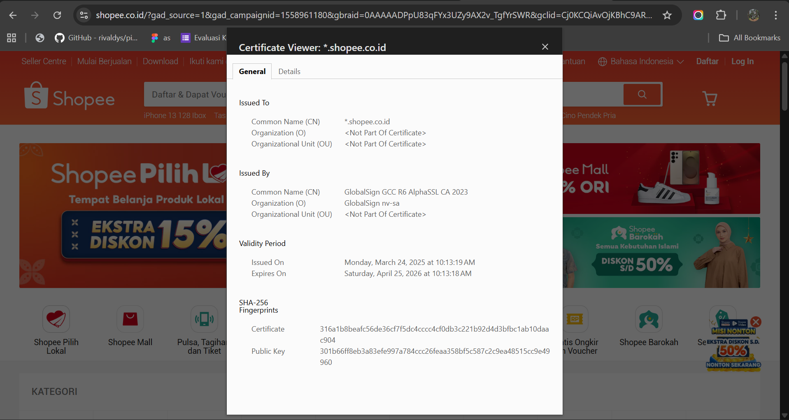

# Laporan Praktikum Kriptografi
Minggu ke-: 12  
Topik: Aplikasi TLS & E-commerce 
Nama: Dimas Aditya Nugroho 
NIM: 230202744 
Kelas: 5 IKrB 

---

## 1. Tujuan
- Menganalisis penggunaan kriptografi pada email dan SSL/TLS.
- Menjelaskan enkripsi dalam transaksi e-commerce.
- Mengevaluasi isu etika & privasi dalam penggunaan kriptografi di kehidupan sehari-hari.

## 2. Dasar Teori
Kriptografi pada layanan email dan protokol SSL/TLS berfungsi untuk menjamin kerahasiaan, keutuhan, serta keaslian data selama proses pertukaran informasi. Pada sistem email, teknologi seperti PGP dan S/MIME memanfaatkan enkripsi kunci publik sehingga hanya pihak penerima yang memiliki kunci yang sesuai yang dapat membaca isi pesan. Selain itu, tanda tangan digital digunakan untuk memastikan identitas pengirim serta mencegah pemalsuan pesan. Sementara itu, SSL/TLS berperan dalam mengamankan komunikasi antara klien dan server di jaringan internet dengan cara mengenkripsi data yang ditransmisikan, sehingga mampu menghindari penyadapan maupun serangan man-in-the-middle.

Dalam konteks transaksi e-commerce, enkripsi memiliki peran krusial dalam menjaga keamanan data sensitif, seperti informasi kartu kredit, data identitas pengguna, dan rincian transaksi. Penggunaan protokol HTTPS yang berbasis SSL/TLS memastikan bahwa data yang dikirimkan antara pengguna dan server tetap terlindungi dari upaya pembacaan maupun manipulasi oleh pihak yang tidak berwenang. Selain itu, penerapan kriptografi juga mendukung proses autentikasi serta non-repudiation, yang pada akhirnya meningkatkan tingkat kepercayaan antara penjual dan pembeli dalam aktivitas perdagangan daring.

Dari perspektif etika dan privasi, kriptografi menjadi sarana penting dalam melindungi hak privasi individu dengan mencegah akses ilegal terhadap data pribadi. Namun demikian, tantangan etis muncul ketika enkripsi tingkat tinggi dimanfaatkan untuk menutupi aktivitas yang melanggar hukum atau ketika pemerintah dan institusi tertentu berupaya membatasi maupun mengakses informasi yang terenkripsi. Oleh sebab itu, penerapan kriptografi perlu disertai dengan kebijakan yang adil dan bertanggung jawab agar tercipta keseimbangan antara keamanan, perlindungan privasi, dan kepentingan publik.
---

## 3. Alat dan Bahan
(- Python 3.x  
- Visual Studio Code / editor lain  
- Git dan akun GitHub  
- Library tambahan (misalnya pycryptodome, jika diperlukan)  )

---

## 4. Langkah Percobaan
- Laporan studi kasus tentang penerapan SSL/TLS pada email dan e-commerce.
- Analisis isu privasi dan etika penggunaan kriptografi.
- Commit Git dengan format week12-aplikasi-tls.

---

## 5. Source Code

---

## 6. Hasil dan Pembahasan

# Langkah 1 — Analisis SSL/TLS Website E-commerce (Shopee)

Berdasarkan hasil pengecekan sertifikat digital pada website Shopee melalui browser, diketahui bahwa Shopee telah menggunakan sertifikat keamanan HTTPS yang valid dan terpercaya. Sertifikat ini berfungsi untuk menjamin keamanan pertukaran data antara pengguna dan server, terutama pada aktivitas sensitif seperti login dan transaksi online.

- Issuer CA (Certificate Authority):
Sertifikat Shopee diterbitkan oleh GlobalSign nv-sa dengan Common Name GlobalSign GCC R6 AlphaSSL CA 2023. GlobalSign merupakan salah satu Certificate Authority internasional yang terpercaya dan diakui oleh browser modern.

- Masa Berlaku Sertifikat:
Sertifikat mulai berlaku pada 24 Maret 2025 dan akan berakhir pada 25 April 2026, dengan masa berlaku sekitar satu tahun sesuai standar keamanan TLS saat ini.

- Algoritma Enkripsi yang Digunakan:
Sertifikat menggunakan algoritma RSA sebagai algoritma kunci publik dan SHA-256 sebagai algoritma hash untuk tanda tangan digital. Dalam komunikasi HTTPS, Shopee menggunakan protokol TLS dengan algoritma enkripsi simetris seperti AES untuk menjaga keamanan data selama proses transmisi.

Website yang menggunakan HTTPS memiliki tingkat keamanan yang jauh lebih baik dibandingkan website yang masih menggunakan HTTP. HTTPS memastikan data pengguna terenkripsi dan identitas website terverifikasi, sedangkan website tanpa HTTPS sangat rentan terhadap penyadapan dan manipulasi data.

# Langkah 2 — Studi Kasus Penggunaan Enkripsi pada E-commerce

Enkripsi pada Shopee digunakan untuk melindungi data pengguna selama proses login dan transaksi pembayaran. Protokol TLS mengenkripsi data sensitif sehingga tidak dapat dibaca oleh pihak lain meskipun terjadi penyadapan.

Jika TLS tidak digunakan, data akan dikirim dalam bentuk teks terbuka dan rentan terhadap serangan Man-in-the-Middle (MITM). Serangan ini memungkinkan penyerang mencuri atau memanipulasi informasi penting seperti username, password, dan data pembayaran, yang dapat mengakibatkan pencurian akun serta kerugian finansial bagi pengguna.

# Langkah 3 — Analisis Etika & Priva
Identifikasi Isu Privasi pada Email Terenkripsi (PGP & S/MIME)

Penggunaan email terenkripsi seperti PGP dan S/MIME meningkatkan kerahasiaan komunikasi karena hanya pengirim dan penerima yang dapat membaca isi pesan. Namun, hal ini menimbulkan isu privasi seperti keterbatasan akses bagi organisasi untuk melakukan pengawasan keamanan, potensi penyalahgunaan untuk aktivitas ilegal, serta risiko kebocoran kunci privat yang dapat membuka akses ke email pribadi.

Dilema Etika

1. Apakah perusahaan boleh melakukan dekripsi email karyawan untuk audit?
Secara etika, perusahaan boleh melakukan audit jika email digunakan untuk kepentingan pekerjaan dan kebijakan tersebut jelas, transparan, dan disetujui karyawan. Namun, mendekripsi email pribadi tanpa izin melanggar privasi dan hak individu.

2. Bagaimana kebijakan pemerintah dalam pengawasan komunikasi terenkripsi?
Pemerintah menghadapi dilema antara keamanan nasional dan hak privasi warga. Pengawasan komunikasi terenkripsi umumnya diperbolehkan secara terbatas, harus melalui dasar hukum yang jelas, izin pengadilan, dan pengawasan ketat, agar tidak disalahgunakan dan tetap melindungi kebebasan berkomunikasi.
---

## 7. Jawaban Pertanyaan
- Pertanyaan 1:
Perbedaan mendasar antara HTTP dan HTTPS terletak pada aspek keamanannya. HTTP mentransmisikan data dalam bentuk teks biasa tanpa perlindungan enkripsi, sehingga informasi yang dikirim mudah untuk disadap atau dimanipulasi. Sebaliknya, HTTPS menggunakan protokol TLS untuk mengenkripsi data, sehingga informasi yang dipertukarkan menjadi lebih aman dan terlindungi dari akses pihak yang tidak berwenang.

- Pertanyaan 2:
Sertifikat digital memiliki peran penting dalam komunikasi berbasis TLS karena digunakan untuk melakukan verifikasi identitas suatu website. Dengan adanya sertifikat digital, pengguna dapat memastikan bahwa koneksi yang terjalin benar-benar menuju server yang sah, sehingga mencegah risiko komunikasi dengan pihak palsu atau berbahaya.

- Pertanyaan 3:
Kriptografi berkontribusi besar dalam menjaga privasi komunikasi digital dengan cara mengenkripsi data agar hanya dapat diakses oleh pihak yang memiliki otorisasi. Namun, di sisi lain, penerapan kriptografi yang kuat juga menimbulkan tantangan dari aspek hukum dan etika, karena dapat membatasi proses pengawasan oleh aparat penegak hukum serta memunculkan perdebatan terkait keseimbangan antara keamanan, perlindungan privasi, dan kepentingan publik.
---

## 8. Kesimpulan
Kesimpulan: Berdasarkan percobaan dan analisis yang dilakukan, kriptografi terbukti berperan penting dalam menjaga keamanan komunikasi digital, baik pada email maupun transaksi e-commerce melalui penerapan SSL/TLS dan enkripsi data. Penggunaan HTTPS dan sertifikat digital mampu melindungi data sensitif dari penyadapan dan serangan pihak tidak berwenang. Namun, penerapan kriptografi juga menimbulkan tantangan etika dan hukum, sehingga diperlukan kebijakan yang seimbang antara perlindungan privasi, keamanan, dan kepentingan publik.

## 9. Daftar Pustaka
 
- Katz, J., & Lindell, Y. *Introduction to Modern Cryptography*.  
- Stallings, W. *Cryptography and Network Security*.  

---

## 10. Commit Log

commit week12-aplikasi-tls
Author: Dimas Aditya Nugroho <dimasngr31@gmail.com>
Date:   2026-01-05

    week12-apliaksi-tls: implementasi Aplikasi TLS & E-commerce Shopee dan
