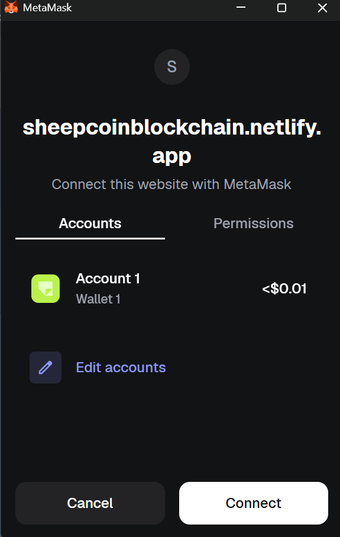
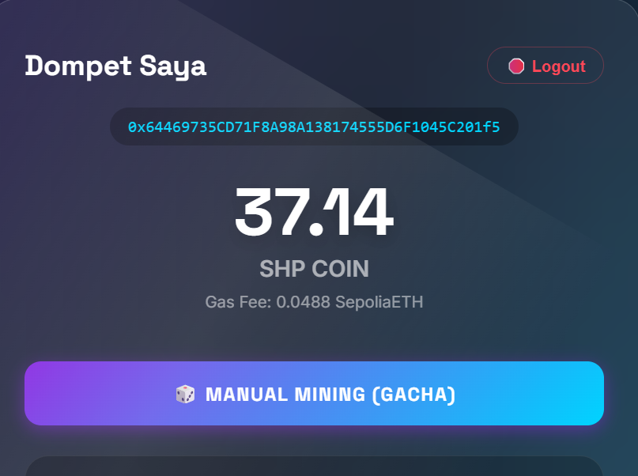
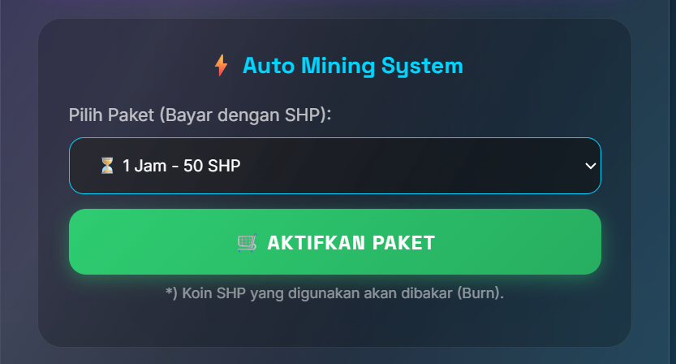
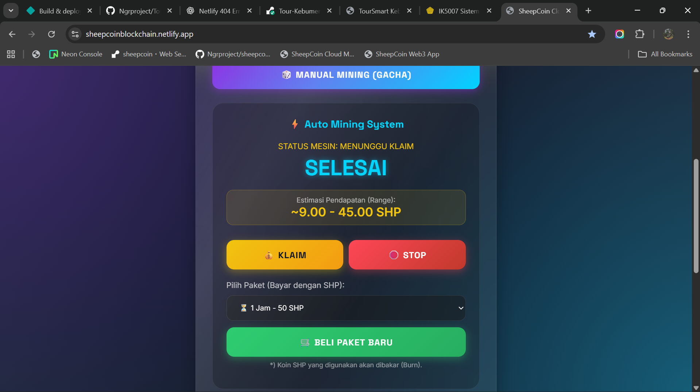
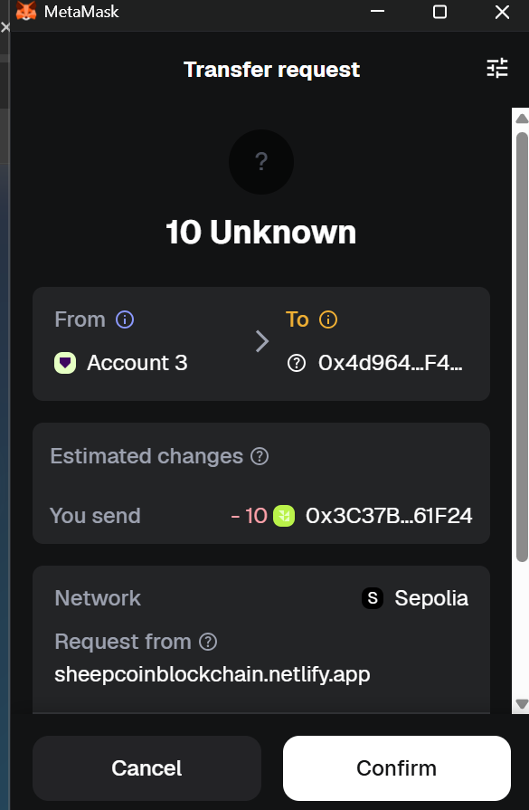
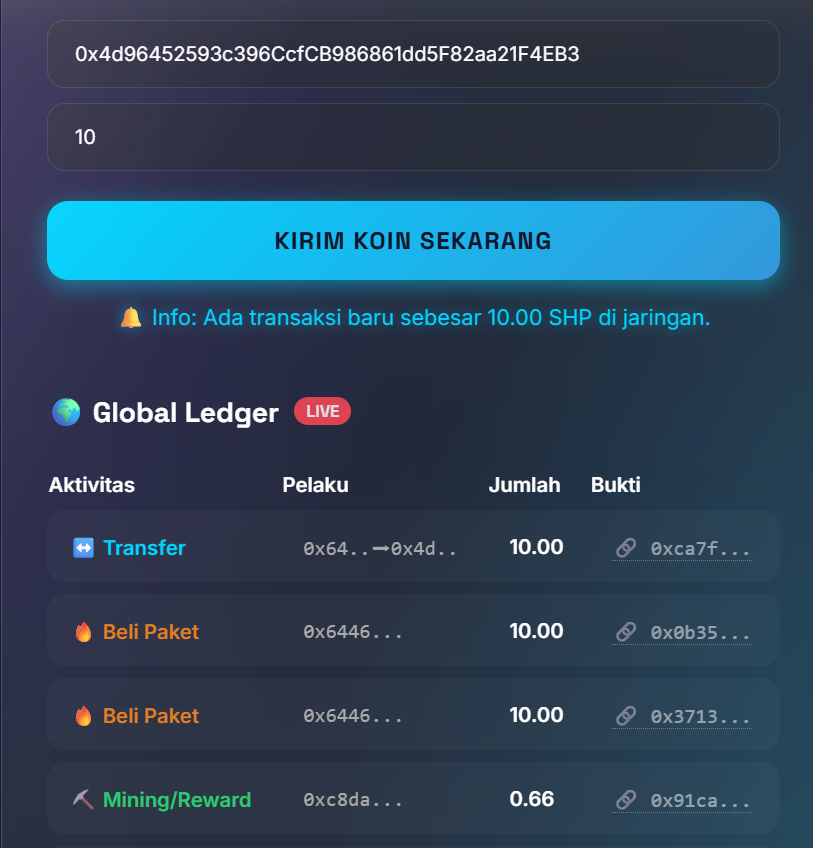

# Laporan Praktikum Kriptografi
Minggu ke-: 16  
Topik: UAS KRIPTOGRAFI SHEEPCOIN 
Nama: DIMAS ADITYA NUGROHO 
NIM: 230202744 
Kelas: 5 IKRB

---

## 1. Tujuan
- Media edukasi, untuk membantu pengguna memahami konsep dasar blockchain, transaksi kripto, dan smart contract.
- Simulasi sistem mining token, baik secara manual maupun otomatis, sehingga pengguna dapat mempelajari mekanisme perolehan token secara langsung.
- Sarana praktik implementasi smart contract, khususnya pada token ERC-20 dan interaksi dengan dompet digital seperti MetaMask.
---

## 2. Dasar Teori
Perkembangan teknologi Blockchain dan Web3 hadir untuk mengatasi keterbatasan sistem digital terpusat yang rentan terhadap manipulasi dan ketergantungan pada pihak ketiga. Blockchain menyediakan pencatatan data yang aman dan transparan, sedangkan Web3 memungkinkan kepemilikan data dan aset digital oleh pengguna melalui sistem desentralisasi. Teknologi ini mendorong inovasi seperti DeFi, dan NFT yang berpotensi meningkatkan kepercayaan, efisiensi, dan inklusi digital, meskipun masih menghadapi tantangan regulasi dan adopsi.

---

## 3. Alat dan Bahan
- VS CODE
- Akun Github
- Akun Metamask
- Netlify
- Front End menggunakan HTML,CSS,JavaScript
- Blockchain Library menggunakan Remix IDE
- Smartcontract menggunakan Solidity
- Network menggunakan Ethereum Sepolia

---

## 4. Langkah Percobaan
# Login Sheepcoin

- Akses sheepcoin dengan masuk ke url https://sheepcoinblockchain.netlify.app/
- Lalu klik hubungkan Metamask


- Jika Muncul Popup Metamask klik izinkan dan konfirmasi

# Halaman Utama

- Setelah terhubung ke metamask maka tampilan utama Sheepcoin telah terbuka, di halaman ini ada beberapa menu utama. Seperti informasi akun, informasi saldo, minning manual, auto minning, transfer cepat, history blokcain global, dan logout.

# Manual Minning

- klik tombol manual minning


- setelah itu maka akan muncul konfirmasi darimetamask, klik konfirmasi. Maka sistem akan melakukan minning di server blockchain


- jika minning berhasil maka saldo akan bertambah dan muncul riwayat transaksi global.

# Auto Minning

- Auto minning adalah fitur yang memungkinkan pengguna untuk melakukan minning otomatis, dengan cara menyewa bot auto minning.


- pilih durasi auto minning sesuai kebutuhan
- lalu klik aktifkan paket


- jika muncul popup klik izinkan maka fitur auto minning akan berjalan


- auto minning telah berjalan
- anda bisa melakukan stop dan claim rewards dengan menekan tombol yg telah disediakan 


- jika waktu auto mining habis, maka anda bisa melakukan claim reward secara keseluruhan atau menambah paket durasi lagi. dan saldo akan bertambah.

# Transfer

- pilih ke menu transfer
- masukan code wallet unik penerima (0x.............)
- masukan nominal yang akan and transfer
- klik "kirim koin sekarang"


- lakukan konfirmasi di metamask
- tunggu sampai koin berhasil terkirim


- semua transaksi oleh semua user akan tercatat pada history global
---

## 5. Source Code


## 6. Hasil dan Pembahasan
Cara Kerja :
- User berinteraksi melalui browser
- Transaksi ditandatangani MetaMask
- Smart contract mengeksekusi logic
- Data tercatat di blockchain

Kelebihan Sistem :
- Terdesentralisasi
- Transparan
- Real-time
- Cocok untuk pembelajaran kriptografi & blockchain
- Bisa dikembangkan ke mainnet

Batas Sistem :
- Nilai token tidak nyata
- Bergantung pada MetaMask
- Belum ada sistem anti-bot
- Tidak menggunakan uang asli
- Hanya untuk simulasi / pembelajaran

## 8. Kesimpulan
Sistem ini berhasil mengimplementasikan Web3 dengan optimal Perkembangannya membuka peluang besar dalam berbagai sektor dengan meningkatkan efisiensi, kepercayaan, serta kepemilikan aset digital oleh pengguna. Meskipun masih menghadapi tantangan dari sisi regulasi dan adopsi, koin ini memiliki potensi kuat sebagai fondasi ekosistem digital di masa depan.


## 9. Daftar Pustaka
(Cantumkan referensi yang digunakan.  
Contoh:  
- Katz, J., & Lindell, Y. *Introduction to Modern Cryptography*.  
- Stallings, W. *Cryptography and Network Security*.  )

---

## 10. Commit Log
commit uas kripto Sheepcoin
Author: Dimas Aditya Nugroho
Date:   2026-01-18

    week16 - UAS : UAS KRIPTOGRAFI SHEEPCOIN 
```
