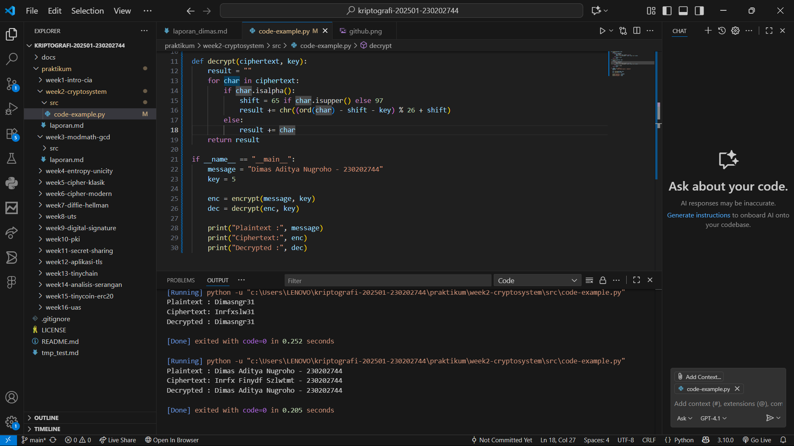
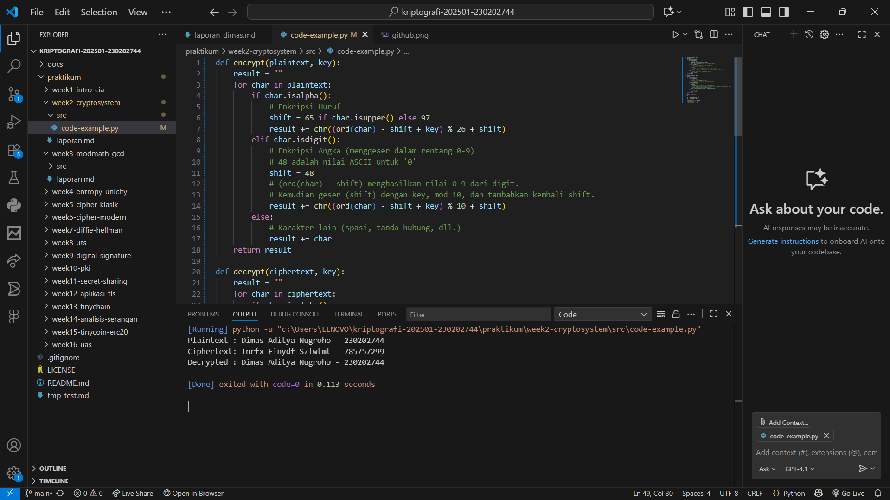
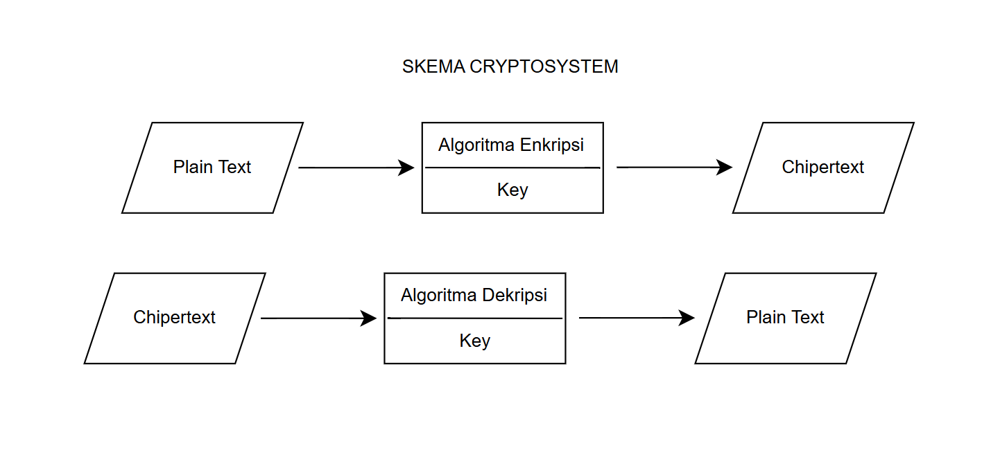

# Laporan Praktikum Kriptografi
Minggu ke-: 2 
Topik: Cryptosystem (Komponen, Enkripsi & Dekripsi, Simetris & Asimetris) 
Nama: Dimas Aditya Nugroho
NIM: 230202744  
Kelas: 5 IKRB

---

## 1. Tujuan
Mengidentifikasi komponen dasar kriptosistem (plaintext, ciphertext, kunci, algoritma).
Menggambarkan proses enkripsi dan dekripsi sederhana.
Mengklasifikasikan jenis kriptosistem (simetris dan asimetris).
---

## 2. Dasar Teori
Era Kriptografi Klasik
Pada era klasik, teknik enkripsi sederhana digunakan untuk menjaga rahasia pesan. Contohnya Caesar Cipher yang menggantikan setiap huruf dengan huruf lain pada posisi tertentu dalam alfabet, dan Vigenere Cipher yang menggunakan kunci berupa kata untuk menggeser huruf secara bergantian. Meskipun cukup efektif pada masanya, metode ini rentan terhadap analisis frekuensi dan teknik kriptoanalisis sederhana

Caesar Cipher adalah salah satu teknik kriptografi klasik yang menyandikan pesan dengan cara menggeser setiap huruf dalam teks asli (plaintext) sejauh jumlah tertentu dalam alfabet. Misalnya, dengan kunci pergeseran 3, huruf A menjadi D, B menjadi E, dan seterusnya. Metode ini termasuk jenis substitution cipher karena mengganti setiap huruf dengan huruf lain berdasarkan pola tertentu. Meskipun sederhana dan mudah dipahami, Caesar Cipher tergolong tidak aman karena hanya memiliki sedikit kemungkinan kunci, sehingga mudah dipecahkan.
---

## 3. Alat dan Bahan
(- Python 3.x  
- Visual Studio Code / editor lain  
- Git dan akun GitHub  
- Library tambahan (misalnya pycryptodome, jika diperlukan)  )

---

## 4. Langkah Percobaan
(Tuliskan langkah yang dilakukan sesuai instruksi.  
Contoh format:
1. Membuat file `simple_crypto.py` di folder `praktikum/week2-cryptosystem/src/`.
2. Menyalin kode program dari panduan praktikum.
3. Menjalankan program dengan perintah (`python simple_crypto.py`.)
4. Melakukan modifikasi program supaya angka juga bisa ikut ter enkripsi dengan cara menambahkan baris
            elif char.isdigit():
            # Enkripsi Angka (menggeser dalam rentang 0-9)
            # 48 adalah nilai ASCII untuk '0'
            shift = 48
            # (ord(char) - shift) menghasilkan nilai 0-9 dari digit.
            # Kemudian geser (shift) dengan key, mod 10, dan tambahkan kembali shift.
            result += chr((ord(char) - shift + key) % 10 + shift)
        else:
            # Karakter lain (spasi, tanda hubung, dll.)
            result += char
)
---

## 5. Source Code
def encrypt(plaintext, key):
    result = ""
    for char in plaintext:
        if char.isalpha():
            # Enkripsi Huruf
            shift = 65 if char.isupper() else 97
            result += chr((ord(char) - shift + key) % 26 + shift)
        elif char.isdigit():
            # Enkripsi Angka (menggeser dalam rentang 0-9)
            # 48 adalah nilai ASCII untuk '0'
            shift = 48
            # (ord(char) - shift) menghasilkan nilai 0-9 dari digit.
            # Kemudian geser (shift) dengan key, mod 10, dan tambahkan kembali shift.
            result += chr((ord(char) - shift + key) % 10 + shift)
        else:
            # Karakter lain (spasi, tanda hubung, dll.)
            result += char
    return result

def decrypt(ciphertext, key):
    result = ""
    for char in ciphertext:
        if char.isalpha():
            # Dekripsi Huruf
            shift = 65 if char.isupper() else 97
            # Untuk dekripsi, kita kurangi key, kemudian mod 26
            result += chr((ord(char) - shift - key) % 26 + shift)
        elif char.isdigit():
            # Dekripsi Angka
            shift = 48
            # Untuk dekripsi, kita kurangi key, kemudian mod 10
            # Penting: Di Python, operasi modulo (%) dengan angka negatif akan bekerja dengan benar
            # untuk "membungkus" kembali ke angka positif.
            result += chr((ord(char) - shift - key) % 10 + shift)
        else:
            # Karakter lain
            result += char
    return result

if __name__ == "__main__":
    message = "Dimas Aditya Nugroho - 230202744"
    key = 5

    enc = encrypt(message, key)
    dec = decrypt(enc, key)

    print("Plaintext :", message)
    print("Ciphertext:", enc)
    print("Decrypted :", dec)
---

## 6. Hasil dan Pembahasan
Hasil dari program yang diberikan dari github menunjukan bahwa enkripsi yang digunakan adalah caesar chiper dengan hasil enkripsi hanya teks berupa huruf saja yang terenkripsi sedangkan angka tidak terenkripsi, lalu saya modifikasi programnya dengan menambahkan baris :
         elif char.isdigit():
            # Enkripsi Angka (menggeser dalam rentang 0-9)
            # 48 adalah nilai ASCII untuk '0'
            shift = 48
            # (ord(char) - shift) menghasilkan nilai 0-9 dari digit.
            # Kemudian geser (shift) dengan key, mod 10, dan tambahkan kembali shift.
            result += chr((ord(char) - shift + key) % 10 + shift)
dengan menambahkan baris tersebut maka sekarang karakter angka pun menjadi ikut terenkripsi juga. untuk perbandingan hasilnya bisa dilihat pada tangkapan layar berikut

Hasil eksekusi program Caesar Cipher:





---

## 7. Jawaban Pertanyaan
### Perbedaan Key Simetris dan Asimetris
- Kriptografi Simetris itu seperti menggunakan satu kunci rumah yang sama untuk mengunci dan membukanya. Ini cepat dan bagus untuk mengamankan data yang sangat banyak (misalnya, hard drive Anda), tapi masalahnya, Anda harus menemukan cara aman untuk memberikan salinan kunci itu kepada teman Anda.
Contoh :
+ AES (Advanced Encryption Standard)
AES bekerja dengan blok data berukuran 128 bit dan mendukung panjang kunci 128, 192, atau 256 bit. Algoritma ini dikenal cepat dan memiliki tingkat keamanan tinggi, sehingga banyak digunakan dalam berbagai aplikasi seperti sistem keamanan Wi-Fi (WPA2) dan layanan penyimpanan cloud.
Contoh penggunaan: AES-256 digunakan untuk mengenkripsi file dan komunikasi di aplikasi seperti WhatsApp serta layanan penyimpanan online.
+ DES (Data Encryption Standard)
DES merupakan algoritma lama yang menggunakan blok data 64 bit dengan kunci 56 bit. Meskipun kini dianggap kurang aman karena ukuran kuncinya yang pendek, DES memiliki peran penting dalam sejarah perkembangan kriptografi modern dan menjadi dasar bagi algoritma yang lebih kuat seperti 3DES.
Contoh penggunaan: Dahulu digunakan pada sistem keamanan perbankan dan mesin ATM sebelum digantikan oleh AES.

- Kriptografi Asimetris itu seperti memiliki kotak surat khusus dengan dua kunci: satu Kunci Publik yang semua orang tahu (untuk memasukkan surat/enkripsi), dan satu Kunci Privat yang hanya Anda pegang (untuk membuka kotak/dekripsi). Ini jauh lebih lambat, tapi sangat ampuh untuk memulai komunikasi aman dan memastikan bahwa pesan itu benar-benar dari si pengirim yang sah (tanda tangan digital).
Contoh :
+ RSA (Rivest–Shamir–Adleman)
RSA didasarkan pada kesulitan memfaktorkan bilangan prima besar. Algoritma ini umum digunakan untuk mengenkripsi pesan, membuat tanda tangan digital, dan mengamankan komunikasi pada protokol HTTPS.
Contoh penggunaan: RSA melindungi proses pertukaran kunci antara browser dan server ketika pengguna mengakses situs web yang menggunakan HTTPS.
+ ECC (Elliptic Curve Cryptography)
ECC menggunakan konsep matematika kurva eliptik untuk menghasilkan keamanan yang kuat dengan ukuran kunci yang lebih kecil dibanding RSA. Karena efisien, ECC banyak digunakan pada perangkat dengan sumber daya terbatas seperti ponsel pintar dan sistem Internet of Things (IoT).
Contoh penggunaan: ECC diterapkan dalam sistem keamanan Bitcoin dan pada sertifikat digital modern seperti SSL/TLS.

# 1. Komponen Utama Kriptografi
- Plaintext – pesan asli atau data yang belum dienkripsi.
- Ciphertext – hasil dari proses enkripsi, yaitu pesan yang sudah diubah menjadi bentuk tidak terbaca.
- Algoritma enkripsi – metode atau rumus yang digunakan untuk mengubah plaintext menjadi ciphertext.
- Algoritma dekripsi – metode yang digunakan untuk mengembalikan ciphertext menjadi plaintext semula.
- Kunci (key) – nilai rahasia yang digunakan dalam proses enkripsi dan dekripsi. Kunci ini menentukan hasil akhir proses kriptografi.

# 2. Kelebihan dan kelemahan sistem simetris dibandingkan asimetris
Sistem simetris memiliki kelebihan dalam hal kecepatan dan efisiensi, terutama saat mengenkripsi data dalam jumlah besar. Namun, kelemahannya terletak pada keamanan distribusi kunci yang harus dijaga agar tidak bocor. Sebaliknya, sistem asimetris lebih aman karena menggunakan dua kunci berbeda, yaitu publik dan privat, yang tidak perlu dibagikan secara langsung. Meskipun demikian, sistem asimetris memiliki kecepatan proses yang lebih lambat dan memerlukan sumber daya komputasi yang lebih besar.

# 3. Mengapa distribusi kunci menjadi masalah utama dalam kriptografi simetris?
Distribusi kunci menjadi masalah utama dalam kriptografi simetris karena pengirim dan penerima harus menggunakan kunci yang sama. Jika kunci tersebut dikirim melalui saluran komunikasi yang tidak aman, maka ada risiko kunci disadap oleh pihak ketiga. Kebocoran kunci akan menyebabkan sistem enkripsi menjadi tidak efektif, karena siapa pun yang mengetahui kunci tersebut dapat membuka pesan terenkripsi.
### 
---

## 8. Kesimpulan
Dari hasil pengujian program yang diambil dari GitHub, dapat disimpulkan bahwa algoritma yang digunakan adalah Caesar Cipher, di mana proses enkripsi awalnya hanya berlaku untuk huruf, sedangkan karakter berupa angka tidak ikut terenkripsi. Setelah dilakukan modifikasi dengan menambahkan logika khusus untuk menangani karakter angka, program kini mampu mengenkripsi baik huruf maupun angka. Dengan demikian, hasil enkripsi menjadi lebih lengkap dan aman karena mencakup seluruh karakter alfanumerik.
---

## 9. Daftar Pustaka
---

## 10. Commit Log
Contoh:
```
(Commit : week2-cryptosystem
Author: Dimas Aditya Nugroho | dimasngr31@gmail.com
Date:   2025-10-12

    week2-cryptosystem: implementasi Caesar Cipher dan laporan )
```
