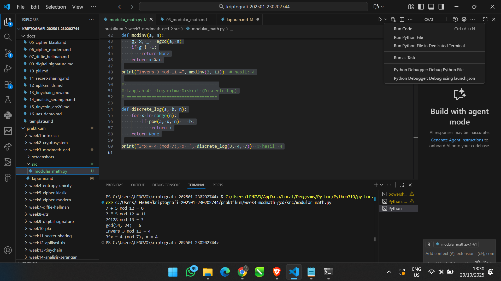

(
# Laporan Praktikum Kriptografi
Minggu ke-: 3
Topik: Modular Math 
Nama: Dimas Aditya Nugroho 
NIM: 230202744 
Kelas: 5 IKRB

---

## 1. Tujuan
1. Menyelesaikan operasi aritmetika modular.  
2. Menentukan bilangan prima dan menghitung GCD (Greatest Common Divisor).  
3. Menerapkan logaritma diskrit sederhana dalam simulasi kriptografi.  
---

## 2. Dasar Teori
Modular arithmetic adalah sistem operasi matematika yang bekerja berdasarkan sisa hasil pembagian terhadap suatu bilangan tertentu (modulus). Dalam sistem ini, hasil operasi seperti penjumlahan, pengurangan, perkalian, dan eksponensiasi selalu diambil sisanya terhadap nilai modulus tersebut, sehingga nilainya selalu berada antara 0 hingga n−1. Konsep ini banyak digunakan dalam bidang kriptografi seperti algoritma RSA dan Diffie-Hellman karena sifat periodiknya yang menjaga hasil tetap dalam rentang tertentu.

GCD (Greatest Common Divisor) atau faktor persekutuan terbesar adalah bilangan bulat terbesar yang dapat membagi habis dua bilangan tanpa menyisakan sisa. Nilai GCD dapat dihitung menggunakan algoritma Euclidean dengan prinsip bahwa GCD(a, b) sama dengan GCD(b, a mod b). Konsep GCD penting dalam kriptografi, terutama untuk menentukan apakah dua bilangan relatif prima dan dalam proses pencarian invers modular.

---

## 3. Alat dan Bahan
(- Python 3.x  
- Visual Studio Code / editor lain  
- Git dan akun GitHub    )

---

## 4. Langkah Percobaan
(Tuliskan langkah yang dilakukan sesuai instruksi.  
Contoh format:
1. Membuat file `modular_math.py` di folder `praktikum/week3-modmath-gcd/src/`.
2. Menyalin kode program dari panduan praktikum.
3. Menjalankan program dengan perintah `python modular_math.py`.)

---

## 5. Source Code
# ====================================
# Langkah 1 — Aritmetika Modular
# ====================================

def mod_add(a, b, n): 
    return (a + b) % n

def mod_sub(a, b, n): 
    return (a - b) % n

def mod_mul(a, b, n): 
    return (a * b) % n

def mod_exp(base, exp, n): 
    return pow(base, exp, n)  # eksponensiasi modular

print("7 + 5 mod 12 =", mod_add(7, 5, 12))
print("7 * 5 mod 12 =", mod_mul(7, 5, 12))
print("7^128 mod 13 =", mod_exp(7, 128, 13))

# ====================================
# Langkah 2 — GCD & Algoritma Euclidean
# ====================================

def gcd(a, b):
    while b != 0:
        a, b = b, a % b
    return a

print("gcd(54, 24) =", gcd(54, 24))

# ====================================
# Langkah 3 — Extended Euclidean Algorithm
# ====================================

def egcd(a, b):
    if a == 0:
        return b, 0, 1
    g, x1, y1 = egcd(b % a, a)
    return g, y1 - (b // a) * x1, x1

def modinv(a, n):
    g, x, _ = egcd(a, n)
    if g != 1:
        return None
    return x % n

print("Invers 3 mod 11 =", modinv(3, 11))  # hasil: 4

# ====================================
# Langkah 4 — Logaritma Diskrit (Discrete Log)
# ====================================

def discrete_log(a, b, n):
    for x in range(n):
        if pow(a, x, n) == b:
            return x
    return None

print("3^x ≡ 4 (mod 7), x =", discrete_log(3, 4, 7))  # hasil: 4

---

## 6. Hasil dan Pembahasan
(Program ini menjelaskan cara kerja dasar aritmetika modular, yaitu sistem perhitungan dengan sisa bagi yang banyak digunakan dalam kriptografi modern.
- Langkah 1:
Fungsi mod_add, mod_sub, mod_mul, dan mod_exp menunjukkan operasi dasar seperti penjumlahan, pengurangan, perkalian, dan perpangkatan dalam sistem modulo.
Contohnya, 7 + 5 mod 12 = 0 karena 12 habis dibagi 12 tanpa sisa.
- Langkah 2:
Fungsi gcd menggunakan Algoritma Euclidean untuk mencari pembagi terbesar dari dua angka.
Hasilnya, gcd(54, 24) = 6.
- Langkah 3:
Fungsi modinv memanfaatkan Extended Euclidean Algorithm untuk mencari invers modular, yaitu angka yang jika dikalikan dengan 3 menghasilkan 1 dalam modulo 11.
Hasilnya adalah 4.
- Langkah 4:
Fungsi discrete_log mencari nilai pangkat x yang memenuhi persamaan a^x ≡ b (mod n).
Pada contoh 3^x ≡ 4 (mod 7), nilai x yang cocok adalah 4.
Kesimpulan:
Secara keseluruhan, program ini memperlihatkan bagaimana operasi dasar matematika modular menjadi pondasi utama dalam algoritma keamanan digital seperti RSA dan Diffie–Hellman. 

Hasil eksekusi program Caesar Cipher:


)

---

## 7. Jawaban Pertanyaan
1. # Peran aritmetika modular dalam kriptografi modern
Aritmetika modular menjadi dasar utama dalam kriptografi karena memungkinkan operasi matematika dilakukan dalam ruang bilangan terbatas. Sistem ini digunakan untuk menjaga hasil perhitungan tetap aman dan efisien. Dalam algoritma seperti RSA atau Diffie-Hellman, aritmetika modular membantu membentuk fungsi yang mudah dihitung tetapi sulit dibalik, sehingga menjaga keamanan data.
2. # Pentingnya invers modular dalam algoritma kunci publik
Invers modular berperan penting karena digunakan untuk proses dekripsi. Dalam algoritma RSA, kunci privat dihitung sebagai invers modular dari kunci publik terhadap fungsi totien. Tanpa invers ini, pesan yang sudah dienkripsi tidak bisa dikembalikan ke bentuk aslinya, sehingga keamanan komunikasi tetap terjaga.
3. # Tantangan utama dalam logaritma diskrit untuk modulus besar
Masalah utama dalam logaritma diskrit adalah sulitnya menemukan nilai pangkat yang sesuai saat modulusnya sangat besar. Tidak ada cara cepat untuk menghitungnya, sehingga membutuhkan waktu komputasi yang sangat lama. Kesulitan inilah yang membuat algoritma seperti Diffie-Hellman dan ElGamal tetap aman digunakan.
---

## 8. Kesimpulan
(Tuliskan kesimpulan singkat (2–3 kalimat) berdasarkan percobaan.  )

---

## 9. Daftar Pustaka
---

## 10. Commit Log
commit modular_math
Author: Dimas Aditya Nugroho <dimasngr31@gmail.com>
Date:   2025-10-20

    week3-modmath-gcd: modular_math )
```
