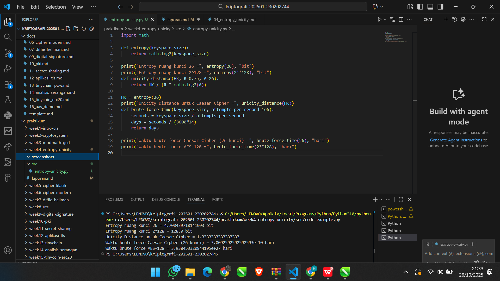

# Laporan Praktikum Kriptografi
Minggu ke-: 4
Topik: entropy-unicity 
Nama: Dimas Aditya Nugroho  
NIM: 230202744
Kelas: 5 IKRB  

---

## 1. Tujuan 
1. Menyelesaikan perhitungan sederhana terkait entropi kunci.  
2. Menggunakan teorema Euler pada contoh perhitungan modular & invers.  
3. Menghitung *unicity distance* untuk ciphertext tertentu.  
4. Menganalisis kekuatan kunci berdasarkan entropi dan unicity distance.  
5. Mengevaluasi potensi serangan brute force pada kriptosistem sederhana. 
---

## 2. Dasar Teori
Entropi kunci merupakan ukuran ketidakpastian atau jumlah informasi rata-rata yang terkandung dalam suatu ruang kunci. Semakin besar nilai entropi, semakin sulit kunci ditebak oleh penyerang karena jumlah kemungkinan kunci semakin banyak. Nilai entropi dihitung dengan rumus H(K) = log2(|K|), di mana |K| adalah jumlah kemungkinan kunci. Sementara itu, unicity distance menggambarkan panjang minimum ciphertext yang diperlukan agar kunci dapat ditentukan secara unik berdasarkan informasi statistik plaintext. Secara matematis dinyatakan dengan U = H(K) / D, di mana H(K) adalah entropi kunci dan D adalah redundansi bahasa per simbol. Hubungan keduanya menunjukkan bahwa semakin besar entropi kunci, semakin besar pula unicity distance yang dibutuhkan, sehingga kriptosistem menjadi lebih kuat terhadap analisis statistik dan serangan brute force.
---

## 3. Alat dan Bahan
(- Python 3.x  
- Visual Studio Code / editor lain  
- Git dan akun GitHub  
- Library tambahan (misalnya pycryptodome, jika diperlukan)  )

---

## 4. Langkah Percobaan
1. Membuat file `entropy_unicity.py` di folder `praktikum/week3_entropy_unicity/src/`.
2. Menyalin kode program dari panduan praktikum.
4.  Langkah 1 — Perhitungan Entropi
Gunakan rumus:  
\[
H(K) = \log_2 |K|
\]  
dengan \(|K|\) adalah ukuran ruang kunci. 
5. Langkah 2 — Menghitung Unicity Distance
Gunakan rumus:  
\[
U = \frac{H(K)}{R \cdot \log_2 |A|}
\]  
dengan:  
- \(H(K)\): entropi kunci,  
- \(R\): redundansi bahasa (misal bahasa Inggris \(R \approx 0.75\)),  
- \(|A|\): ukuran alfabet (26 untuk A–Z).
6.Langkah 3 — Analisis Brute Force
Simulasikan waktu brute force dengan asumsi kecepatan komputer tertentu.  
7. Menjalankan program dengan perintah `python entropy_unicity.py`.)

---

## 5. Source Code
import math

def entropy(keyspace_size):
    return math.log2(keyspace_size)

print("Entropy ruang kunci 26 =", entropy(26), "bit")
print("Entropy ruang kunci 2^128 =", entropy(2**128), "bit")
def unicity_distance(HK, R=0.75, A=26):
    return HK / (R * math.log2(A))

HK = entropy(26)
print("Unicity Distance untuk Caesar Cipher =", unicity_distance(HK))
def brute_force_time(keyspace_size, attempts_per_second=1e6):
    seconds = keyspace_size / attempts_per_second
    days = seconds / (3600*24)
    return days

print("Waktu brute force Caesar Cipher (26 kunci) =", brute_force_time(26), "hari")
print("Waktu brute force AES-128 =", brute_force_time(2**128), "hari")


---

## 6. Hasil dan Pembahasan
Hasil uji program menunjukkan bahwa nilai entropi ruang kunci untuk Caesar Cipher sebesar 4,7 bit, sedangkan untuk AES-128 mencapai 128 bit. Hal ini menunjukkan bahwa Caesar Cipher memiliki ruang kunci yang sangat kecil dan tingkat ketidakpastian yang rendah, sementara AES-128 memiliki ruang kunci yang sangat besar sehingga jauh lebih aman. Nilai unicity distance untuk Caesar Cipher diperoleh sekitar 1,33, yang berarti hanya diperlukan sekitar satu karakter teks untuk dapat menentukan kunci secara unik. Selain itu, estimasi waktu brute force dengan asumsi satu juta percobaan per detik menghasilkan waktu sekitar 10 hari untuk Caesar Cipher, sedangkan untuk AES-128 mencapai sekitar 3,9×10³⁸ hari, yang secara praktis mustahil dilakukan. Berdasarkan hasil tersebut, dapat disimpulkan bahwa hasil pengujian sesuai dengan ekspektasi teoretis, di mana cipher klasik seperti Caesar sangat mudah dipecahkan, sedangkan algoritma modern seperti AES memiliki tingkat keamanan yang sangat tinggi karena ukuran ruang kuncinya yang besar.
Hasil eksekusi program entropy_unicity:




---

## 7. Jawaban Pertanyaan
1. Nilai entropy menggambarkan seberapa acak atau sulitnya sebuah kunci untuk ditebak. Semakin tinggi nilainya, semakin banyak kemungkinan kunci yang harus dicoba agar bisa menemukan yang benar. Artinya, kunci dengan entropy besar jauh lebih aman karena tidak mudah ditebak atau dibobol dengan percobaan acak.

2. Unicity distance penting karena menunjukkan seberapa banyak potongan ciphertext yang dibutuhkan agar seseorang bisa menebak kunci dengan pasti. Kalau data yang didapat lebih sedikit dari nilai ini, penyerang belum bisa menentukan kunci dengan jelas. Tapi kalau datanya sudah lebih banyak, kunci bisa ditemukan lewat analisis pola huruf atau statistik, jadi nilai ini membantu menilai seberapa kuat suatu cipher terhadap upaya pembobolan lewat analisis.

3. Serangan brute force masih jadi ancaman karena cara ini tidak butuh kelemahan dari algoritma itu sendiri. Penyerang cukup mencoba semua kemungkinan kunci satu per satu sampai menemukan yang cocok. Meskipun algoritmanya kuat, kalau panjang kuncinya terlalu pendek atau daya komputasi penyerang sangat besar, brute force tetap bisa berhasil. Karena itu, kunci harus dibuat cukup panjang supaya waktu untuk menebaknya jadi tidak masuk akal lama.
---

## 8. Kesimpulan
Berdasarkan hasil percobaan, dapat disimpulkan bahwa peningkatan ukuran ruang kunci berbanding lurus dengan nilai entropi serta tingkat keamanan kriptosistem. Caesar Cipher memiliki entropi dan unicity distance yang rendah sehingga mudah diretas, sedangkan AES-128 menunjukkan keamanan yang jauh lebih kuat karena memiliki ruang kunci yang sangat luas. Dengan demikian, hasil percobaan ini mendukung teori bahwa kekuatan suatu cipher sangat dipengaruhi oleh kompleksitas dan panjang kuncinya.
---

## 9. Daftar Pustaka
---

## 10. Commit Log
```
week4-entropy-unicity
Author: Dimas Aditya Nugroho <dimasngr31@gmail.com>
Date:   2025-10-26

week4-entropy-unicity 
```
