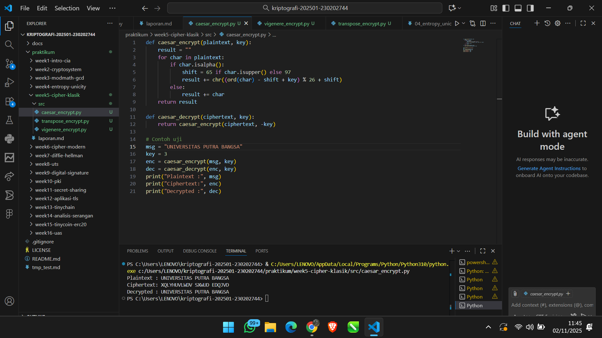
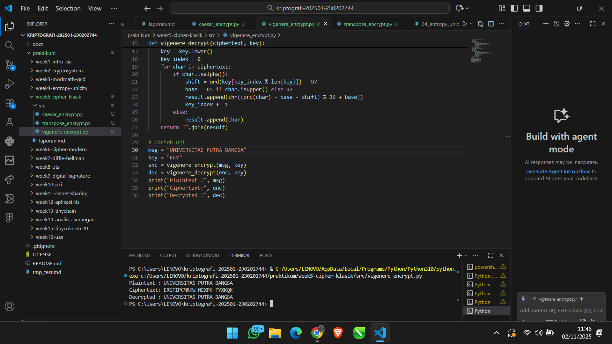
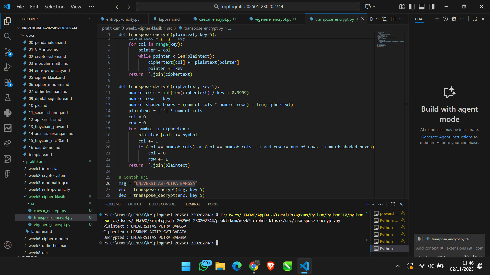
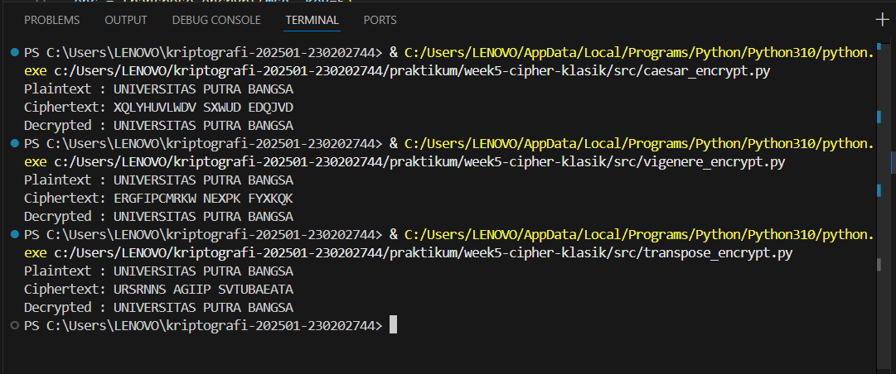

# Laporan Praktikum Kriptografi
Minggu ke-: 5  
Topik: Cipher Klasik (Caesar, Vigenère, Transposisi) 
Nama: Dimas Aditya Nugroho 
NIM: 230202744  
Kelas: 5 IKRB  

---

## 1. Tujuan
Setelah mengikuti praktikum ini, mahasiswa diharapkan mampu:

1. Menerapkan algoritma Caesar Cipher untuk enkripsi dan dekripsi teks.
2. Menerapkan algoritma Vigenère Cipher dengan variasi kunci.
3. Mengimplementasikan algoritma transposisi sederhana.
4. Menjelaskan kelemahan algoritma kriptografi klasik.
---

## 2. Dasar Teori
1. Caesar Cipher
Caesar Cipher merupakan salah satu jenis algoritma enkripsi tertua yang termasuk dalam kelompok substitution cipher atau sandi substitusi sederhana. Metode ini diperkenalkan oleh Julius Caesar untuk mengamankan pesan-pesan militernya. Prinsip dasar dari Caesar Cipher adalah menggantikan setiap huruf pada teks asli (plaintext) dengan huruf lain yang terletak beberapa posisi setelahnya dalam urutan alfabet. Jumlah pergeseran huruf ini disebut sebagai kunci (key). Misalnya, jika kunci yang digunakan adalah 3, maka huruf A akan berubah menjadi D, B menjadi E, dan seterusnya.

- Rumus enkripsi:
C = (P + k) mod 26
- Rumus dekripsi:
P = (C - k) mod 26
- Keterangan:
P = huruf plaintext (dalam bentuk angka 0–25)
C = huruf ciphertext
k = jumlah pergeseran huruf

Kelebihan dari Caesar Cipher adalah kesederhanaannya serta kemudahan implementasi baik secara manual maupun digital. Namun, kelemahannya terletak pada tingkat keamanannya yang sangat rendah karena hanya terdapat 25 kemungkinan kunci. Oleh karena itu, cipher ini sangat mudah dipecahkan menggunakan metode brute force atau frequency analysis.

2. Vigenère Cipher

Vigenère Cipher merupakan pengembangan dari Caesar Cipher yang termasuk dalam kelompok polyalphabetic substitution cipher. Berbeda dengan Caesar Cipher yang menggunakan satu kunci tetap untuk semua huruf, Vigenère Cipher menggunakan kata kunci (key word) yang menentukan besarnya pergeseran berbeda untuk setiap huruf dalam plaintext. Setiap huruf pada kata kunci mewakili nilai pergeseran berdasarkan urutan alfabet (misalnya, A=0, B=1, C=2, dan seterusnya). Kata kunci ini akan diulang sepanjang pesan agar setiap huruf plaintext memiliki pergeseran yang berbeda.

- umus enkripsi:
Ci = (Pi + Ki) mod 26

- Rumus dekripsi:
Pi = (Ci - Ki) mod 26

- Keterangan:
Pi = huruf ke-i dari plaintext
Ci = huruf ke-i dari ciphertext
Ki = huruf ke-i dari kunci

Kelebihan Vigenère Cipher terletak pada kompleksitasnya yang lebih tinggi dibanding Caesar Cipher, karena menggunakan beberapa alfabet dalam proses substitusi sehingga tidak mudah dipecahkan dengan analisis frekuensi sederhana. Namun, cipher ini masih dapat diretas dengan metode seperti Kasiski Examination atau Friedman Test yang digunakan untuk menemukan panjang kunci.

3. Cipher Transposisi

Cipher Transposisi atau Transposition Cipher merupakan metode enkripsi yang bekerja dengan menukar posisi huruf-huruf dalam teks asli tanpa mengubah huruf itu sendiri. Dengan kata lain, cipher ini tidak mengganti huruf seperti pada substitusi, melainkan hanya mengubah urutannya berdasarkan aturan atau pola tertentu yang ditentukan oleh kunci. Salah satu jenis yang umum digunakan adalah Columnar Transposition Cipher, di mana pesan ditulis ke dalam tabel berdasarkan panjang kunci, kemudian huruf-huruf dibaca menurut urutan kolom sesuai urutan kunci tersebut.

- Rumus umum enkripsi:
C = T(P, k)

- Rumus umum dekripsi:
P = T⁻¹(C, k)

- Keterangan:
T = fungsi transposisi berdasarkan kunci k

Kelebihan dari Cipher Transposisi adalah huruf-huruf dalam ciphertext memiliki frekuensi yang sama dengan plaintext, sehingga sulit dipecahkan menggunakan analisis frekuensi. Namun, kelemahannya adalah cipher ini dapat direkonstruksi melalui analisis pola atau dengan mencoba berbagai susunan urutan huruf jika panjang pesan diketahui.

---

## 3. Alat dan Bahan
(- Python 3.x  
- Visual Studio Code / editor lain  
- Git dan akun GitHub  
- Library tambahan (misalnya pycryptodome, jika diperlukan)  )

---

## 4. Langkah Percobaan
(Tuliskan langkah yang dilakukan sesuai instruksi.  
Contoh format:
1. Membuat file `caesar.py, transpose.py, vigenere.py` di folder `praktikum/week5-cipher-klasik/src/`.
2. Menyalin kode program dari panduan praktikum.
3. Mengimplementasikan ketiga algoritma enkripsi tersebut
4. Menjalankan program dengan perintah `caesar.py, transpose.py, vigenere.py`.
5. Menganalisis hasil perbandingan dari ketiga algortima tersebut )

---

## 5. Source Code
- Caesar.py
def caesar_encrypt(plaintext, key):
    result = ""
    for char in plaintext:
        if char.isalpha():
            shift = 65 if char.isupper() else 97
            result += chr((ord(char) - shift + key) % 26 + shift)
        else:
            result += char
    return result

def caesar_decrypt(ciphertext, key):
    return caesar_encrypt(ciphertext, -key)

# Contoh uji
msg = "UNIVERSITAS PUTRA BANGSA"
key = 3
enc = caesar_encrypt(msg, key)
dec = caesar_decrypt(enc, key)
print("Plaintext :", msg)
print("Ciphertext:", enc)
print("Decrypted :", dec)

- Vignere.py
def vigenere_encrypt(plaintext, key):
    result = []
    key = key.lower()
    key_index = 0
    for char in plaintext:
        if char.isalpha():
            shift = ord(key[key_index % len(key)]) - 97
            base = 65 if char.isupper() else 97
            result.append(chr((ord(char) - base + shift) % 26 + base))
            key_index += 1
        else:
            result.append(char)
    return "".join(result)

def vigenere_decrypt(ciphertext, key):
    result = []
    key = key.lower()
    key_index = 0
    for char in ciphertext:
        if char.isalpha():
            shift = ord(key[key_index % len(key)]) - 97
            base = 65 if char.isupper() else 97
            result.append(chr((ord(char) - base - shift) % 26 + base))
            key_index += 1
        else:
            result.append(char)
    return "".join(result)

# Contoh uji
msg = "UNIVERSITAS PUTRA BANGSA"
key = "KEY"
enc = vigenere_encrypt(msg, key)
dec = vigenere_decrypt(enc, key)
print("Plaintext :", msg)
print("Ciphertext:", enc)
print("Decrypted :", dec)

- transpose.py
def transpose_encrypt(plaintext, key=5):
    ciphertext = [''] * key
    for col in range(key):
        pointer = col
        while pointer < len(plaintext):
            ciphertext[col] += plaintext[pointer]
            pointer += key
    return ''.join(ciphertext)

def transpose_decrypt(ciphertext, key=5):
    num_of_cols = int(len(ciphertext) / key + 0.9999)
    num_of_rows = key
    num_of_shaded_boxes = (num_of_cols * num_of_rows) - len(ciphertext)
    plaintext = [''] * num_of_cols
    col = 0
    row = 0
    for symbol in ciphertext:
        plaintext[col] += symbol
        col += 1
        if (col == num_of_cols) or (col == num_of_cols - 1 and row >= num_of_rows - num_of_shaded_boxes):
            col = 0
            row += 1
    return ''.join(plaintext)

# Contoh uji
msg = "UNIVERSITAS PUTRA BANGSA"
enc = transpose_encrypt(msg, key=5)
dec = transpose_decrypt(enc, key=5)
print("Plaintext :", msg)
print("Ciphertext:", enc)
print("Decrypted :", dec)
---

## 6. Hasil dan Pembahasan
1. Caesar Cipher

Berdasarkan hasil percobaan pada program Caesar Cipher dengan plaintext “UNIVERSITAS PUTRA BANGSA” dan kunci pergeseran sebesar 3, diperoleh ciphertext “XQLYHUVLWDV SXWUD EDQJVD”. Proses dekripsi berhasil mengembalikan teks ke bentuk aslinya dengan sempurna. Hal ini menunjukkan bahwa algoritma bekerja dengan baik dalam melakukan enkripsi dan dekripsi menggunakan metode pergeseran huruf tetap. Kelebihan dari Caesar Cipher adalah implementasinya yang sangat sederhana dan proses enkripsi yang cepat. Namun, kelemahannya cukup signifikan, yaitu tingkat keamanannya sangat rendah karena hanya memiliki 25 kemungkinan kunci. Cipher ini juga mudah dipecahkan menggunakan serangan brute force atau analisis frekuensi karena pola huruf yang dihasilkan tetap terlihat jelas. Oleh sebab itu, Caesar Cipher lebih cocok digunakan untuk pembelajaran dasar kriptografi, bukan untuk keamanan data yang sebenarnya.

2. Vigenere Cipher

Pada algoritma Vigenere Cipher, pengujian dilakukan dengan plaintext yang sama yaitu “UNIVERSITAS PUTRA BANGSA” dan menggunakan kunci “KEY”. Hasil enkripsi menghasilkan ciphertext “ERGFPICRKWN NEXPFK FVYXQK”, sedangkan proses dekripsi berhasil mengembalikan teks menjadi bentuk aslinya tanpa kesalahan. Hasil tersebut menunjukkan bahwa Vigenere Cipher memiliki tingkat kerandoman yang lebih tinggi dibanding Caesar Cipher, karena setiap huruf dienkripsi menggunakan pergeseran yang berbeda-beda sesuai dengan karakter kunci. Kelebihan utama dari algoritma ini adalah kemampuannya untuk mengaburkan pola huruf sehingga lebih sulit diserang menggunakan analisis frekuensi. Meskipun demikian, Vigenere Cipher tetap memiliki kelemahan, terutama jika kunci yang digunakan terlalu pendek atau berulang, karena hal itu dapat menyebabkan munculnya pola yang dapat dianalisis menggunakan metode seperti Kasiski examination. Secara umum, Vigenere Cipher menawarkan keamanan yang lebih baik dibanding Caesar Cipher, terutama bila kunci yang digunakan cukup panjang dan acak.

3. Transpose Cipher

Pada pengujian algoritma Transposition Cipher dengan plaintext “UNIVERSITAS PUTRA BANGSA” dan kunci 5, diperoleh ciphertext “URSRNNS AGP STVUUBAEETA”. Proses dekripsi juga berhasil mengembalikan pesan ke bentuk aslinya secara sempurna, yang menunjukkan bahwa algoritma berfungsi dengan benar. Berbeda dengan dua algoritma sebelumnya yang menggunakan metode substitusi, Transposition Cipher bekerja dengan cara mengubah posisi huruf tanpa mengubah karakter aslinya. Kelebihan dari metode ini adalah hasil enkripsi yang sulit dibaca tanpa mengetahui kuncinya, karena posisi huruf tampak acak. Namun, kelemahannya terletak pada pola penempatan huruf yang masih bisa dianalisis jika panjang pesan dan kunci diketahui. Selain itu, karena tidak ada proses substitusi, cipher ini lebih lemah jika berdiri sendiri, tetapi akan jauh lebih kuat apabila dikombinasikan dengan cipher lain seperti Vigenere atau Caesar.



## 7. Jawaban Pertanyaan
1.Kelemahan utama dari Caesar Cipher adalah ruang kuncinya yang sangat kecil, yaitu hanya 25 kemungkinan pergeseran, sehingga sangat mudah dipecahkan dengan serangan brute force. Selain itu, karena setiap huruf pada plaintext selalu digantikan oleh huruf yang sama pada ciphertext, pola huruf tetap terlihat jelas sehingga mudah dianalisis menggunakan frekuensi kemunculan huruf. Sementara itu, Vigenère Cipher memang lebih kuat daripada Caesar karena menggunakan kunci yang lebih panjang dan bersifat polialfabetik, namun tetap memiliki kelemahan apabila panjang kunci dapat ditebak. Jika kunci pendek digunakan berulang kali, pola-pola huruf masih dapat muncul dan diserang menggunakan metode seperti Kasiski examination atau Friedman test.

2. Cipher klasik, seperti Caesar dan Vigenère, mudah diserang dengan analisis frekuensi karena mereka tidak menyembunyikan distribusi kemunculan huruf dalam teks. Dalam bahasa tertentu seperti Bahasa Indonesia atau Inggris, huruf tertentu muncul lebih sering daripada yang lain (misalnya “E” atau “A”). Karena cipher klasik tidak mengubah pola kemunculan huruf secara signifikan, penyerang dapat mencocokkan frekuensi huruf dalam ciphertext dengan pola umum bahasa untuk menebak substitusi yang digunakan.

3. Perbandingan antara cipher substitusi dan cipher transposisi terletak pada cara mereka menyamarkan pesan. Cipher substitusi mengganti setiap huruf atau simbol pada plaintext dengan huruf lain, sedangkan cipher transposisi hanya mengubah posisi huruf tanpa menggantinya. Kelebihan cipher substitusi adalah proses enkripsi yang lebih sederhana, namun kelemahannya adalah pola frekuensi huruf masih dapat dikenali. Di sisi lain, cipher transposisi lebih baik dalam menyembunyikan pola frekuensi karena huruf-huruf asli tetap digunakan, tetapi urutannya diacak. Namun, cipher ini mudah diserang jika pola pengacakan atau panjang blok diketahui, sehingga sering kali digunakan bersama cipher substitusi untuk meningkatkan keamanan.
---

## 8. Kesimpulan
Berdasarkan hasil penelitian yang dilakukan terhadap penerapan tiga algoritma kriptografi klasik yaitu Caesar Cipher, Vigenère Cipher, dan Transposition Cipher, dapat disimpulkan bahwa masing-masing algoritma memiliki karakteristik, tingkat keamanan, dan efektivitas yang berbeda dalam proses enkripsi dan dekripsi teks. Hasil pengujian menunjukkan bahwa Caesar Cipher mampu melakukan proses enkripsi dengan cepat dan sederhana, namun memiliki kelemahan utama pada aspek keamanan karena ruang kunci yang kecil serta pola huruf yang mudah ditebak melalui analisis frekuensi.

Sementara itu, Vigenère Cipher menunjukkan tingkat keamanan yang lebih baik dibandingkan Caesar Cipher. Penggunaan kunci berupa kata membuat pola pergeseran huruf menjadi lebih acak dan sulit diprediksi, sehingga mengurangi kemungkinan serangan berbasis analisis frekuensi. Namun, jika kunci yang digunakan terlalu pendek atau berulang, cipher ini tetap dapat diretas dengan metode seperti Kasiski examination. Di sisi lain, Transposition Cipher menghasilkan ciphertext yang sulit dibaca karena posisi huruf diacak tanpa mengubah huruf aslinya. Meskipun demikian, cipher ini masih dapat dianalisis jika panjang pesan atau pola pengacakan diketahui.

Secara keseluruhan, hasil penelitian menunjukkan bahwa ketiga algoritma dapat bekerja dengan baik dalam proses enkripsi dan dekripsi menggunakan Python. Namun, tingkat keamanan yang dihasilkan masih tergolong rendah untuk digunakan dalam sistem keamanan modern. Oleh karena itu, algoritma kriptografi klasik ini lebih tepat digunakan sebagai dasar pembelajaran untuk memahami konsep enkripsi dan dekripsi sebelum mempelajari algoritma kriptografi modern seperti AES atau RSA.
---

## 9. Daftar Pustaka

## 10. Commit Log
commit week5-cipher-klasik
Author: Dimas Aditya Nugroho <dimasngr31@gmail.com>
Date:   2025-11-02

    week5-cipher-klasik: implementasi Cipher Klasik (Caesar, Vigenère, Transposisi)
```
