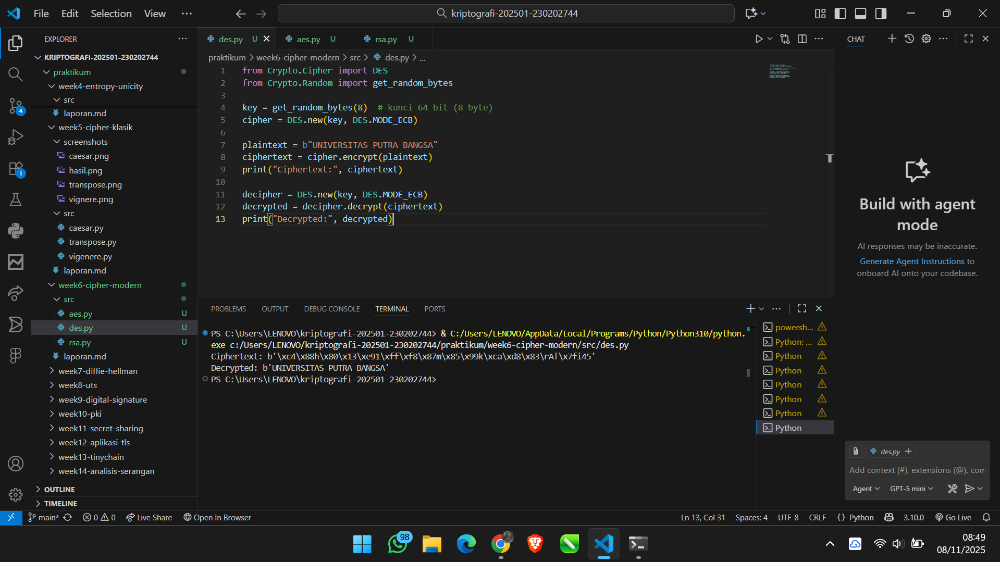
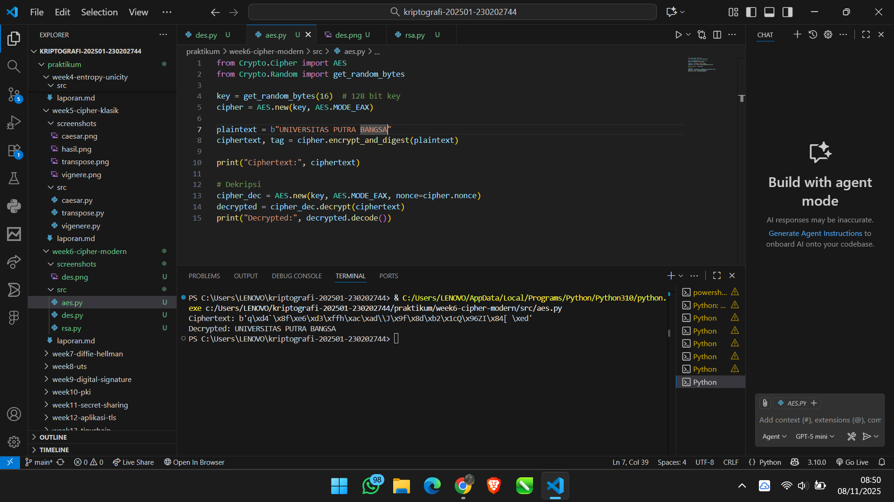
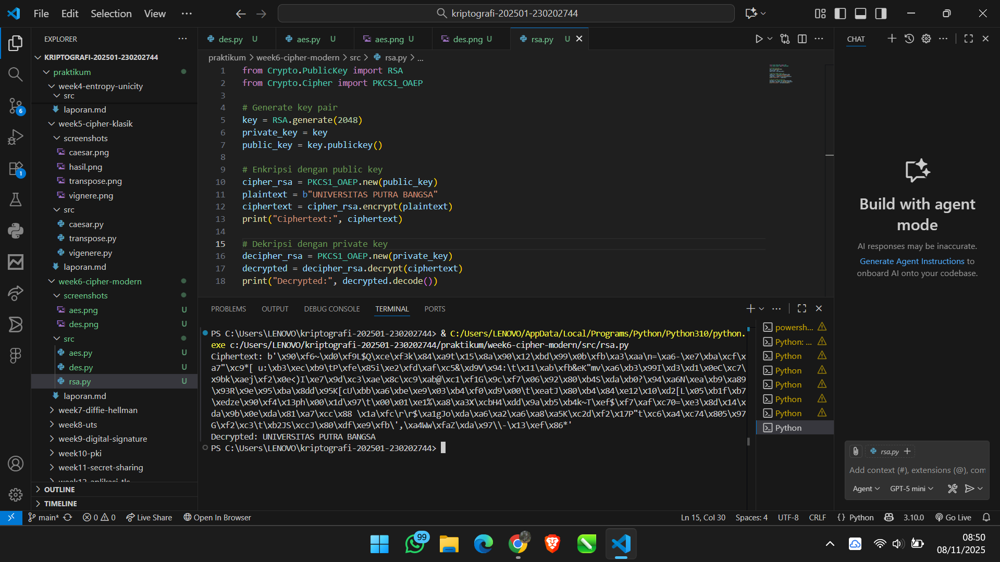
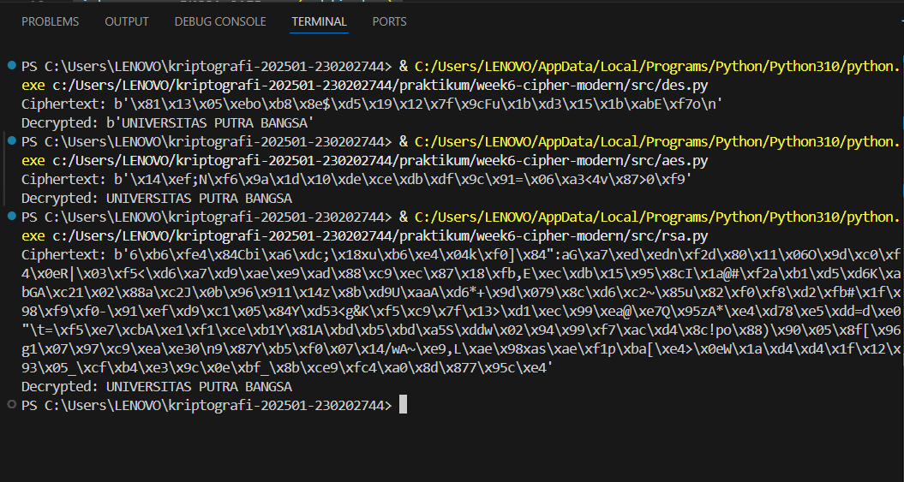

# Laporan Praktikum Kriptografi
Minggu ke-: 6  
Topik: Cipher Modern (DES, AES, RSA) 
Nama: Dimas Aditya Nugroho 
NIM: 230202744
Kelas: 5 IKRB

---

## 1. Tujuan
1. Mengimplementasikan algoritma DES untuk blok data sederhana.
2. Menerapkan algoritma AES dengan panjang kunci 128 bit.
3. Menjelaskan proses pembangkitan kunci publik dan privat pada algoritma RSA.
---

## 2. Dasar Teori
Cipher modern merupakan perkembangan dari cipher klasik yang dirancang untuk mengatasi kelemahan dalam keamanan dan efisiensi. Cipher jenis ini menggunakan prinsip matematika yang kompleks dan proses komputasi digital, sehingga lebih sulit dipecahkan menggunakan metode analisis kriptografi sederhana. Tujuan utama cipher modern adalah menjaga kerahasiaan, keaslian, serta integritas data dalam sistem komunikasi digital. Tiga algoritma yang paling dikenal dalam kategori ini adalah DES (Data Encryption Standard), AES (Advanced Encryption Standard), dan RSA (Rivest–Shamir–Adleman), yang masing-masing memiliki karakteristik dan penerapan berbeda sesuai kebutuhan keamanan.

DES dan AES termasuk dalam kategori symmetric key cipher, di mana proses enkripsi dan dekripsi menggunakan kunci yang sama. DES bekerja dengan membagi data menjadi blok 64 bit dan melakukan proses substitusi serta permutasi dalam beberapa putaran. Sementara itu, AES merupakan penyempurnaan DES dengan ukuran blok 128 bit dan panjang kunci yang lebih fleksibel (128, 192, atau 256 bit), sehingga lebih aman terhadap serangan brute force. Berbeda dengan keduanya, RSA adalah asymmetric key cipher yang menggunakan sepasang kunci publik dan privat berdasarkan prinsip faktorisasi bilangan prima besar. RSA sering digunakan untuk enkripsi kunci, tanda tangan digital, dan autentikasi karena tingkat keamanannya yang tinggi meskipun prosesnya lebih lambat dibanding algoritma simetris.
---

## 3. Alat dan Bahan
1. Buat folder berikut:
praktikum/week6-cipher-modern/
├─ src/
├─ screenshots/
└─ laporan.md
2. Gunakan Python 3.11 atau lebih baru.
3. Install library tambahan:
pip install pycryptodome
4. Materi rujukan: Stallings (2017), Bab 3–4.

---

## 4. Langkah Percobaan
1. Membuat file `aes.py, des.py, rsa.py` di folder `praktikum/week6-cipher-modern/src/`.
2. Menyalin kode program dari panduan praktikum.
3. Mengimplementasikan ketiga algoritma enkripsi tersebut
4. Menjalankan program dengan perintah `aes.py, des.py, rsa.py`.
5. Menganalisis hasil perbandingan dari ketiga algortima tersebut

---

## 5. Source Code
1. Aes.py
from Crypto.Cipher import DES
from Crypto.Random import get_random_bytes

key = get_random_bytes(8)  # kunci 64 bit (8 byte)
cipher = DES.new(key, DES.MODE_ECB)

plaintext = b"UNIVERSITAS PUTRA BANGSA"
ciphertext = cipher.encrypt(plaintext)
print("Ciphertext:", ciphertext)

decipher = DES.new(key, DES.MODE_ECB)
decrypted = decipher.decrypt(ciphertext)
print("Decrypted:", decrypted)

2. aes.py
from Crypto.Cipher import AES
from Crypto.Random import get_random_bytes

key = get_random_bytes(16)  # 128 bit key
cipher = AES.new(key, AES.MODE_EAX)

plaintext = b"UNIVERSITAS PUTRA BANGSA"
ciphertext, tag = cipher.encrypt_and_digest(plaintext)

print("Ciphertext:", ciphertext)

# Dekripsi
cipher_dec = AES.new(key, AES.MODE_EAX, nonce=cipher.nonce)
decrypted = cipher_dec.decrypt(ciphertext)
print("Decrypted:", decrypted.decode())

3. rsa.py
from Crypto.PublicKey import RSA
from Crypto.Cipher import PKCS1_OAEP

# Generate key pair
key = RSA.generate(2048)
private_key = key
public_key = key.publickey()

# Enkripsi dengan public key
cipher_rsa = PKCS1_OAEP.new(public_key)
plaintext = b"UNIVERSITAS PUTRA BANGSA"
ciphertext = cipher_rsa.encrypt(plaintext)
print("Ciphertext:", ciphertext)

# Dekripsi dengan private key
decipher_rsa = PKCS1_OAEP.new(private_key)
decrypted = decipher_rsa.decrypt(ciphertext)
print("Decrypted:", decrypted.decode())

## 6. Hasil dan Pembahasan
1. Algoritma Des
Berdasarkan hasil implementasi kode di atas, proses enkripsi dan dekripsi menggunakan algoritma DES (Data Encryption Standard) berhasil dilakukan dengan baik. Pada tahap awal, program menghasilkan kunci acak sepanjang 64 bit yang digunakan untuk mengenkripsi plaintext “UNIVERSITAS PUTRA BANGSA” dalam mode ECB (Electronic Codebook). Hasil enkripsi berupa ciphertext dalam bentuk byte acak yang tidak dapat dibaca, menandakan bahwa data telah berhasil disandikan menggunakan kunci tersebut.

Selanjutnya, proses dekripsi dilakukan dengan menggunakan kunci yang sama, sehingga plaintext asli dapat dipulihkan kembali secara utuh menjadi “UNIVERSITAS PUTRA BANGSA”. Hal ini menunjukkan bahwa algoritma DES bekerja secara simetris, di mana kunci yang digunakan untuk enkripsi juga digunakan untuk dekripsi. Meskipun DES mampu melindungi data dengan baik dalam contoh ini, algoritma ini kini dianggap kurang aman untuk aplikasi modern karena panjang kuncinya yang pendek (64 bit) rentan terhadap serangan brute force.

2. Algoritma AES
Pada implementasi kode di atas, proses enkripsi dan dekripsi dilakukan menggunakan algoritma AES (Advanced Encryption Standard) dengan panjang kunci 128 bit dalam mode EAX. Mode ini tidak hanya mengenkripsi data, tetapi juga menyediakan mekanisme autentikasi untuk memastikan integritas pesan. Hasil enkripsi berupa ciphertext dalam bentuk deretan byte acak yang sulit ditebak, menandakan bahwa plaintext telah berhasil diubah menjadi bentuk terenkripsi menggunakan kunci dan nonce yang dihasilkan secara acak.

Proses dekripsi menggunakan kunci dan nonce yang sama berhasil mengembalikan data ke bentuk semula, yaitu “UNIVERSITAS PUTRA BANGSA”. Hal ini menunjukkan bahwa algoritma AES bekerja secara simetris, di mana kunci yang sama digunakan untuk enkripsi dan dekripsi. Dibandingkan dengan DES, AES jauh lebih aman karena memiliki panjang kunci yang lebih besar dan struktur internal yang lebih kompleks, sehingga lebih tahan terhadap serangan brute force maupun kriptanalisis modern.

3. Algoritma RSA
Pada implementasi kode di atas, digunakan algoritma RSA (Rivest–Shamir–Adleman) yang termasuk dalam kategori asymmetric key cipher, di mana proses enkripsi dan dekripsi menggunakan dua kunci berbeda, yaitu public key dan private key. Public key digunakan untuk mengenkripsi data, sementara private key digunakan untuk mendekripsinya. Dalam contoh ini, plaintext “UNIVERSITAS PUTRA BANGSA” berhasil dienkripsi menjadi ciphertext berupa deretan byte acak menggunakan public key, yang tidak dapat dikembalikan ke bentuk semula tanpa private key yang sesuai.

Proses dekripsi dengan private key berhasil mengembalikan ciphertext menjadi teks asli, menandakan bahwa sistem kunci publik RSA bekerja dengan benar. Kelebihan utama RSA adalah tingkat keamanannya yang tinggi karena bergantung pada kesulitan faktorisasi bilangan prima besar, menjadikannya sulit ditembus dengan brute force. Namun, RSA juga memiliki kekurangan, yaitu proses enkripsi dan dekripsi yang relatif lebih lambat dibanding algoritma simetris seperti DES dan AES. Oleh karena itu, RSA umumnya digunakan untuk pertukaran kunci atau tanda tangan digital, bukan untuk enkripsi data berukuran besar.

perbandingan ketiga enkripsi bisa dilihat pada gambar berikut
 
---

## 7. Jawaban Pertanyaan
1. Perbedaan mendasar antara DES, AES, dan RSA dalam hal kunci dan keamanan
DES dan AES termasuk dalam algoritma simetris, di mana proses enkripsi dan dekripsi menggunakan kunci yang sama, sedangkan RSA adalah asimetris karena menggunakan dua kunci berbeda, yaitu public key dan private key. Dari sisi keamanan, DES kini dianggap lemah karena hanya memiliki panjang kunci 56 bit yang mudah ditembus oleh serangan brute force. AES lebih kuat dengan panjang kunci hingga 256 bit dan struktur enkripsi yang kompleks, sementara RSA mengandalkan konsep matematika faktorisasi bilangan prima besar, sehingga menawarkan keamanan tinggi meski dengan kecepatan pemrosesan yang lebih lambat.

2. Mengapa AES lebih banyak digunakan dibanding DES di era modern
AES lebih banyak digunakan dibanding DES karena memiliki tingkat keamanan yang jauh lebih tinggi dan efisiensi yang lebih baik. DES yang hanya menggunakan kunci 56 bit dapat dipecahkan dengan mudah oleh komputer modern, sedangkan AES memiliki panjang kunci minimal 128 bit dan mampu melindungi data dari serangan brute force maupun kriptanalisis. Selain itu, AES dirancang agar optimal di berbagai platform, baik perangkat keras maupun perangkat lunak, sehingga menjadi standar utama dalam sistem keamanan digital saat ini.

3. Mengapa RSA dikategorikan sebagai algoritma asimetris dan bagaimana proses pembangkitan kuncinya
RSA dikategorikan sebagai algoritma asimetris karena menggunakan dua kunci yang saling terkait, yaitu public key untuk enkripsi dan private key untuk dekripsi. Proses pembangkitan kunci RSA dimulai dengan memilih dua bilangan prima besar, kemudian menghitung hasil perkalian dan fungsi Eulernya untuk menentukan pasangan kunci. Public key dibentuk dari modulus dan eksponen publik, sedangkan private key dihasilkan dari invers eksponen terhadap fungsi Euler. Keamanan RSA terletak pada kesulitan memfaktorkan bilangan besar menjadi dua prima, menjadikannya sangat andal untuk autentikasi dan pertukaran kunci rahasia.
---

## 8. Kesimpulan
Berdasarkan percobaan yang telah dilakukan, ketiga algoritma enkripsi modern DES, AES, dan RSA berhasil diimplementasikan dengan baik dan menunjukkan perbedaan karakteristik dalam penggunaan kunci serta tingkat keamanannya. DES dan AES bekerja secara simetris dengan kunci yang sama untuk enkripsi dan dekripsi, sedangkan RSA bersifat asimetris menggunakan pasangan kunci publik dan privat. Dari hasil percobaan, AES terbukti lebih aman dan efisien dibanding DES, sementara RSA unggul dalam keamanan pertukaran kunci dan autentikasi data, meskipun memiliki kecepatan yang lebih lambat.

## 9. Daftar Pustaka

## 10. Commit Log

commit Cipher Modern (DES, AES, RSA) 
Author: Dimas Aditya Nugroho <dimasngr31@gmail.com>
Date:   2025-11-08
 week6-Cipher Modern (DES, AES, RSA) : Cipher Modern (DES, AES, RSA)

