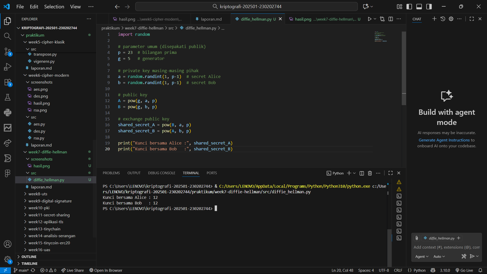
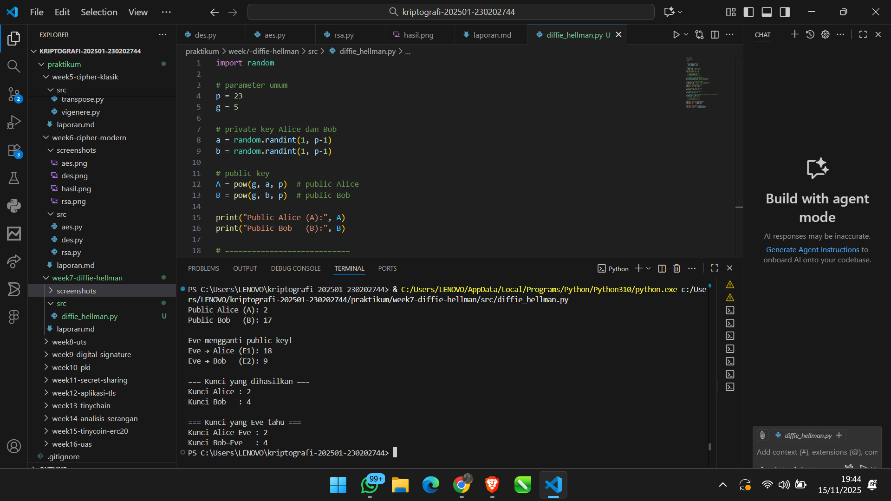

# Laporan Praktikum Kriptografi
Minggu ke-: 7 
Topik: Diffie-Hellman Key Exchange
Nama: Dimas Aditya Nugroho 
NIM: 230202744 
Kelas: 5 IKRB  

---

## 1. Tujuan
Setelah mengikuti praktikum ini, mahasiswa diharapkan mampu:
Melakukan simulasi protokol Diffie-Hellman untuk pertukaran kunci publik.
Menjelaskan mekanisme pertukaran kunci rahasia menggunakan bilangan prima dan logaritma diskrit.
Menganalisis potensi serangan pada protokol Diffie-Hellman (termasuk serangan Man-in-the-Middle / MITM).
---

## 2. Dasar Teori
Diffie–Hellman Key Exchange adalah sebuah protokol kriptografi kunci publik yang memungkinkan dua pihak bertukar kunci rahasia secara aman melalui kanal komunikasi yang tidak aman tanpa harus saling berbagi kunci terlebih dahulu. Protokol ini bekerja berdasarkan konsep modular exponentiation dan sifat matematis dari Discrete Logarithm Problem (DLP), yaitu masalah yang sangat sulit diselesaikan secara komputasional, sehingga menjamin keamanan proses pertukaran kunci. Dalam mekanismenya, kedua pihak menyepakati bilangan prima besar dan generator publik, kemudian masing-masing menghasilkan kunci privat untuk dihitung menjadi kunci publik; setelah saling bertukar kunci publik, mereka dapat menghitung shared secret yang identik. Kunci bersama ini kemudian dapat digunakan sebagai dasar untuk enkripsi simetris sehingga komunikasi menjadi aman meski data publiknya dapat dilihat oleh pihak luar.
---

## 3. Alat dan Bahan
Buat folder berikut:
praktikum/week7-diffie-hellman/
├─ src/
├─ screenshots/
└─ laporan.md
Gunakan Python 3.11 atau lebih baru.
---

## 4. Langkah Percobaan

1. Membuat file diffie_hellman.py di folder praktikum/week3-dh-mitm/src/.
2. Menyalin kode program Diffie–Hellman (skenario normal).
3. Menjalankan program dengan perintah python diffie_hellman.py dan mencatat hasil kunci bersama.

---

## 5. Source Code
import random

# parameter umum
p = 23
g = 5

# private key Alice dan Bob
a = random.randint(1, p-1)
b = random.randint(1, p-1)

# public key
A = pow(g, a, p)  # public Alice
B = pow(g, b, p)  # public Bob

print("Public Alice (A):", A)
print("Public Bob   (B):", B)

# ============================
#      SIMULASI MITM EVE
# ============================

# Eve memiliki private key-nya sendiri
e1 = random.randint(1, p-1)  # untuk menuju Alice
e2 = random.randint(1, p-1)  # untuk menuju Bob

# Public key Eve yang akan disisipkan
E1 = pow(g, e1, p)  # dikirim ke Alice (mengganti B)
E2 = pow(g, e2, p)  # dikirim ke Bob (mengganti A)

print("\nEve mengganti public key!")
print("Eve → Alice (E1):", E1)
print("Eve → Bob   (E2):", E2)

# Alice menghitung shared key palsu
shared_Alice = pow(E1, a, p)

# Bob menghitung shared key palsu
shared_Bob = pow(E2, b, p)

# Eve dapat menghitung kunci antara dirinya ↔ Alice dan dirinya ↔ Bob
shared_Eve_Alice = pow(A, e1, p)
shared_Eve_Bob = pow(B, e2, p)

# ============================
#        HASIL AKHIR
# ============================

print("\n=== Kunci yang dihasilkan ===")
print("Kunci Alice :", shared_Alice)
print("Kunci Bob   :", shared_Bob)

print("\n=== Kunci yang Eve tahu ===")
print("Kunci Alice–Eve :", shared_Eve_Alice)
print("Kunci Bob–Eve   :", shared_Eve_Bob)

---

## 6. Hasil dan Pembahasan
Percobaan dilakukan dalam dua skenario, yaitu skenario normal dan skenario ketika terjadi serangan Man-in-the-Middle (MITM) oleh Eve. Pada skenario normal, Alice dan Bob saling bertukar public key asli (A dan B). Hasil perhitungan menunjukkan bahwa kunci bersama yang dihasilkan Alice dan Bob selalu sama. Hal ini sesuai dengan teori Diffie–Hellman, karena kedua pihak menghitung nilai g^(ab) mod p, sehingga menghasilkan kunci simetris identik untuk digunakan dalam komunikasi.

Pada skenario kedua, dilakukan simulasi serangan MITM. Eve mencegat pertukaran public key antara Alice dan Bob, kemudian menggantinya dengan public key palsu miliknya sendiri (E1 untuk Alice dan E2 untuk Bob). Akibatnya, Alice menghitung kunci bersama berdasarkan E1, sedangkan Bob menghitung kunci berdasarkan E2. Hasil percobaan menunjukkan bahwa kunci yang dihasilkan Alice berbeda dengan kunci yang dihasilkan Bob. Meskipun demikian, Eve mampu menghitung dua kunci tersebut, yaitu kunci antara Alice–Eve dan kunci antara Bob–Eve, sehingga Eve dapat membaca atau memodifikasi komunikasi di antara keduanya tanpa terdeteksi.

Dari hasil percobaan ini dapat disimpulkan bahwa Diffie–Hellman tanpa mekanisme autentikasi sangat rentan terhadap serangan MITM. Karena Alice dan Bob tidak dapat memastikan bahwa public key yang diterima benar-benar berasal dari pihak yang dimaksud, pihak ketiga dapat dengan mudah menyisipkan kunci palsu. Untuk mengatasi kerentanan ini, diperlukan mekanisme autentikasi tambahan seperti digital signature, sertifikat digital, atau skema Authenticated Diffie–Hellman agar proses pertukaran kunci benar-benar aman dari pihak penyerang.

Hasil eksekusi program diffie_hellman:



---

## 7. Jawaban Pertanyaan
1. Diffie–Hellman memungkinkan pertukaran kunci di saluran publik karena protokol ini bergantung pada sifat matematis Discrete Logarithm Problem (DLP) yang sangat sulit dihitung secara balik. Meskipun kedua pihak bertukar nilai publik seperti g^a mod p dan g^b mod p, pihak luar tidak dapat dengan mudah menemukan kunci privat a atau b, sehingga tidak dapat menghitung kunci rahasia bersama. Dengan demikian, meskipun seluruh komunikasi awal dapat dilihat publik, kunci rahasia tetap aman.

2. Kelemahan utama Diffie–Hellman murni adalah tidak adanya mekanisme autentikasi, sehingga protokol ini rentan terhadap Man-in-the-Middle Attack (MITM). Penyerang dapat memposisikan diri di antara kedua pihak, lalu menyamar sebagai keduanya dengan membentuk dua sesi DH terpisah sehingga mereka tidak pernah berbagi kunci yang sama secara langsung. Karena tidak ada identitas yang diverifikasi, kedua pihak tidak dapat memastikan mereka berkomunikasi dengan orang yang benar.

3. Cara utama mencegah MITM adalah menambahkan mekanisme autentikasi pada proses pertukaran kunci. Autentikasi dapat dilakukan menggunakan sertifikat digital, tanda tangan digital, atau kombinasi DH dengan algoritma kunci publik lain seperti RSA atau ECC untuk memverifikasi identitas masing-masing pihak. Dengan memastikan bahwa nilai publik yang diterima benar-benar milik pihak yang sah, penyerang tidak dapat lagi menyisipkan kunci palsu dan melakukan MITM secara mudah.
---

## 8. Kesimpulan
Berdasarkan percobaan yang dilakukan, dapat disimpulkan bahwa protokol Diffie–Hellman mampu menghasilkan kunci bersama secara aman meskipun proses pertukaran dilakukan melalui saluran publik. Namun, hasil simulasi juga menunjukkan bahwa tanpa mekanisme autentikasi, protokol ini sangat rentan terhadap serangan Man-in-the-Middle. Oleh karena itu, diperlukan penambahan autentikasi seperti tanda tangan digital atau sertifikat agar pertukaran kunci benar-benar aman.

---

## 9. Daftar Pustaka
---

## 10. Commit Log
week7-diffie-hellman
Author: Dimas Aditya Nugroho <dimasngr31@gmail.com>
Date:   2025-11-15

    week7-diffie-hellman
```
