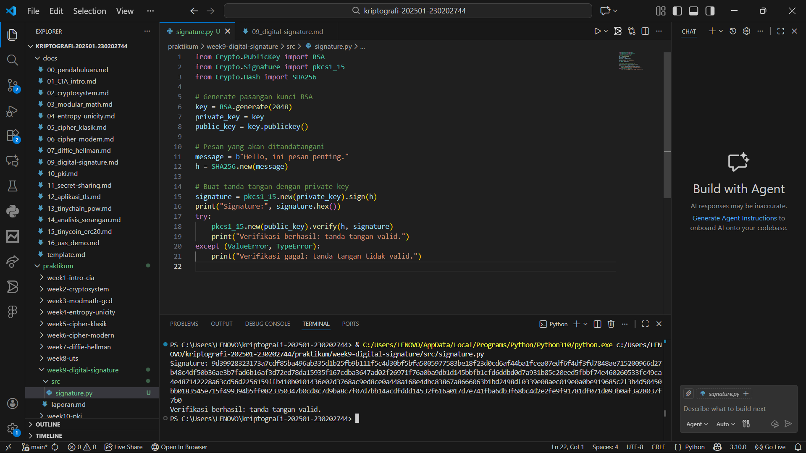
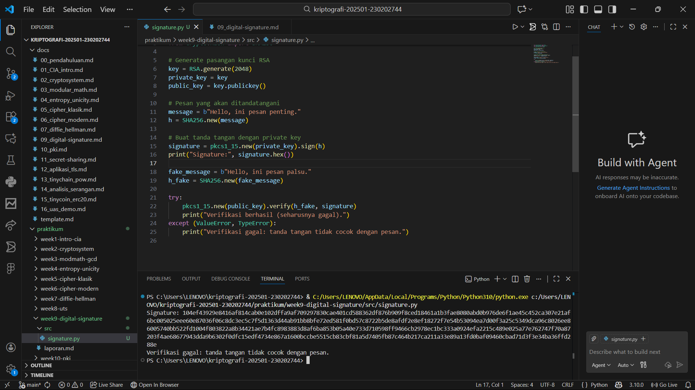

# Laporan Praktikum Kriptografi
Minggu ke-: 9  
Topik: Digital Signature (RSA/DSA)
Nama: Dimas Aditya Nugroho  
NIM: 230202744
Kelas: 5 IKRB  

---

## 1. Tujuan
Setelah mengikuti praktikum ini, mahasiswa diharapkan mampu:  
1. Mengimplementasikan tanda tangan digital menggunakan algoritma RSA/DSA.  
2. Memverifikasi keaslian tanda tangan digital.  
3. Menjelaskan manfaat tanda tangan digital dalam otentikasi pesan dan integritas data.  

---

## 2. Dasar Teori
Digital Signature (RSA/DSA) adalah teknik kriptografi yang digunakan untuk memastikan keaslian pengirim, keutuhan data, dan mencegah penyangkalan atas suatu pesan digital. Prosesnya dilakukan dengan membuat nilai hash dari pesan yang kemudian ditandatangani menggunakan kunci privat pengirim. Verifikasi dilakukan menggunakan kunci publik. Algoritma RSA dan DSA sama-sama berbasis kriptografi kunci publik, di mana RSA dapat digunakan untuk enkripsi dan tanda tangan digital, sedangkan DSA dirancang khusus untuk tanda tangan digital.
---

## 3. Alat dan Bahan
(- Python 3.x  
- Visual Studio Code / editor lain  
- Git dan akun GitHub  
- Library pycryptodome

---

## 4. Langkah Percobaan
(Tuliskan langkah yang dilakukan sesuai instruksi.  
Contoh format:
1. Membuat file `signature.py` di folder `praktikum/week9-digital signature/src/`.
2. Menyalin kode program dari panduan praktikum.
3. Menjalankan program dengan perintah `python signature.py`.
4. Memodifikasi program dengan fake message)

---

## 5. Source Code
from Crypto.PublicKey import RSA
from Crypto.Signature import pkcs1_15
from Crypto.Hash import SHA256

# Generate pasangan kunci RSA
key = RSA.generate(2048)
private_key = key
public_key = key.publickey()

# Pesan yang akan ditandatangani
message = b"Hello, ini pesan penting."
h = SHA256.new(message)

# Buat tanda tangan dengan private key
signature = pkcs1_15.new(private_key).sign(h)
print("Signature:", signature.hex())
# Buat tanda tangan dengan fake message
fake_message = b"Hello, ini pesan palsu."
h_fake = SHA256.new(fake_message)

try:
    pkcs1_15.new(public_key).verify(h_fake, signature)
    print("Verifikasi berhasil (seharusnya gagal).")
except (ValueError, TypeError):
    print("Verifikasi gagal: tanda tangan tidak cocok dengan pesan.")


---

## 6. Hasil dan Pembahasan
Pada praktikum ini, berhasil diimplementasikan mekanisme tanda tangan digital menggunakan algoritma RSA dengan fungsi hash SHA-256. Program menghasilkan pasangan kunci privat dan publik, kemudian digunakan untuk menandatangani pesan asli. Tanda tangan digital yang dihasilkan berupa data biner yang unik dan ditampilkan dalam bentuk heksadesimal.

Hasil pengujian menunjukkan bahwa verifikasi tanda tangan gagal ketika pesan dimodifikasi (fake message), meskipun tanda tangan yang digunakan sama. Hal ini membuktikan bahwa digital signature mampu menjaga integritas data dan mendeteksi perubahan pesan. Selain itu, penggunaan kunci publik untuk verifikasi memastikan bahwa pesan benar-benar berasal dari pemilik kunci privat, sehingga aspek otentikasi dan non-repudiation dapat terpenuhi.

Hasil eksekusi program Caesar Cipher:



)

---

## 7. Jawaban Pertanyaan
1. Perbedaan utama enkripsi RSA dan tanda tangan digital RSA
Enkripsi RSA bertujuan menjaga kerahasiaan pesan dengan kunci publik penerima, sedangkan tanda tangan digital RSA bertujuan menjamin keaslian dan keutuhan pesan dengan menggunakan kunci privat pengirim.
2. Alasan tanda tangan digital menjamin integritas dan otentikasi
Karena tanda tangan dibuat dari hash pesan yang dienkripsi dengan kunci privat, sehingga perubahan pesan dapat terdeteksi (integritas) dan identitas pengirim dapat diverifikasi menggunakan kunci publik (otentikasi).
3. Peran Certificate Authority (CA)
CA berfungsi sebagai pihak tepercaya yang menerbitkan dan memverifikasi sertifikat digital, sehingga memastikan bahwa kunci publik benar-benar milik pemilik yang sah.
---

## 8. Kesimpulan
Praktikum digital signature menggunakan RSA/DSA menunjukkan bahwa tanda tangan digital efektif dalam menjamin keaslian pengirim, keutuhan data, dan non-repudiation. Perubahan sekecil apa pun pada pesan dapat terdeteksi saat proses verifikasi, sehingga keamanan komunikasi digital dapat terjaga dengan baik melalui penggunaan kriptografi kunci publik dan dukungan Certificate Authority.
---

## 9. Daftar Pustaka
---

## 10. Commit Log
Contoh:
```
week9-digital-signature
Author: Dimas Aditya Nugroho
Date:   2025-12-14
    week9 digital signature: Digital Signature (RSA/DSA) ``
